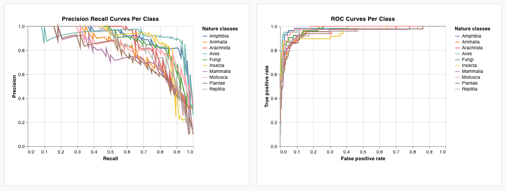

# Custom Charts

**カスタムチャート**を使用して、デフォルトのUIでは現在使用できないチャートを作成します。データの任意の表をログに記録し、希望どおりに視覚化します。[Vega](https://vega.github.io/vega/).の機能で、フォント、色、ツールチップの詳細を制御します。

*   **可能なこと**：[発売のお知らせ](https://wandb.ai/wandb/posts/reports/Announcing-the-W-B-Machine-Learning-Visualization-IDE--VmlldzoyNjk3Nzg)を読む→
*   **コード**：[ホストされているノートブック](https://colab.research.google.com/drive/1uXLKDmsYg7QMRVFyjUAlg-eZH2MW8yWH?usp=sharing)で実際の例を試してください→
*  **ビデオ**：簡単な[ウォークスルービデオ](https://www.youtube.com/watch?v=3-N9OV6bkSM)を見る→
* **例**：QuickKerasおよびSklearn[デモノートブック→](https://colab.research.google.com/drive/1g-gNGokPWM2Qbc8p1Gofud0_5AoZdoSD?usp=sharing)

質問や提案がある場合は、Carey氏（c@wandb.com）に連絡してください。


###  使い方

1. ログデータ：あなたのスクリプトから、W＆Bで実行する場合と同じように、[構成](https://app.gitbook.com/@weights-and-biases/s/docs/~/drafts/-MN_4xmW6jcYndpU_n9G/v/japanese/library/config)データと要約データをログに記録します。特定の時間にログに記録された複数の値のリストを視覚化するには、customwandb.Tableを使用します
2. グラフのカスタマイズ：[GraphQL](https://graphql.org/)

   クエリを使用して、このログデータのいずれかを取得します。効果的な視覚化原理である[Vega](https://vega.github.io/vega/)を使用して、クエリの結果を視覚化します。

3. グラフのログ：`wandb.plot_table（）`を使用してスクリプトから独自のプリセットを呼び出すか、組み込みの1つを使用します。.





## スクリプトからのログチャート

### 組み込みのプリセット

これらのプリセットにはwandb.plotメソッドが組み込まれており、スクリプトから直接グラフをログに記録し、UIで探している正確な視覚化をすばやく確認できます。



`wandb.plot.line()`

カスタム折れ線グラフをログに記録します。これは、任意のxおよびy軸上の接続され順序付けられた点（x、y）のリストです。

```python
data = [[x, y] for (x, y) in zip(x_values, y_values)]
table = wandb.Table(data=data, columns = ["x", "y"])
wandb.log({"my_custom_plot_id" : wandb.plot.line(table, "x", "y", title="Custom Y vs X Line Plot")})
```

これを使用して、任意の2次元の曲線をログに記録できます。2つの値のリストを相互にプロットする場合、リスト内の値の数は正確に一致する必要があることに注意してください（つまり、各ポイントにはxとyが必要です）。


[アプリで見る→](https://wandb.ai/wandb/plots/reports/Custom-Line-Plots--VmlldzoyNjk5NTA)

  [コードを実行→](https://colab.research.google.com/drive/1uXLKDmsYg7QMRVFyjUAlg-eZH2MW8yWH?usp=sharing)



`wandb.plot.scatter()`

Log a custom scatter plot—a list of points \(x, y\) on a pair of arbitrary axes x and y.

```python
data = [[x, y] for (x, y) in zip(class_x_prediction_scores, class_y_prediction_scores)]
table = wandb.Table(data=data, columns = ["class_x", "class_y"])
wandb.log({"my_custom_id" : wandb.plot.scatter(table, "class_x", "class_y")})
```

You can use this to log scatter points on any two dimensions. Note that if you're plotting two lists of values against each other, the number of values in the lists must match exactly \(i.e. each point must have an x and a y\).


[See in the app →](https://wandb.ai/wandb/plots/reports/Custom-Scatter-Plots--VmlldzoyNjk5NDQ)

[Run the code →](https://tiny.cc/custom-charts)



`wandb.plot.bar()`

Log a custom bar chart—a list of labeled values as bars—natively in a few lines:

```python
data = [[label, val] for (label, val) in zip(labels, values)]
table = wandb.Table(data=data, columns = ["label", "value"])
wandb.log({"my_bar_chart_id" : wandb.plot.bar(table, "label", "value", title="Custom Bar Chart")
```

You can use this to log arbitrary bar charts. Note that the number of labels and values in the lists must match exactly \(i.e. each data point must have both\).


[See in the app →](https://wandb.ai/wandb/plots/reports/Custom-Bar-Charts--VmlldzoyNzExNzk)

[Run the code →](https://tiny.cc/custom-charts)



`wandb.plot.histogram()`

Log a custom histogram—sort list of values into bins by count/frequency of occurrence—natively in a few lines. Let's say I have a list of prediction confidence scores \(`scores`\) and want to visualize their distribution:

```python
data = [[s] for s in scores]
table = wandb.Table(data=data, columns=["scores"])
wandb.log({'my_histogram': wandb.plot.histogram(table, "scores", title=None)})
```

You can use this to log arbitrary histograms. Note that `data` is a list of lists, intended to support a 2D array of rows and columns.


[See in the app →](https://wandb.ai/wandb/plots/reports/Custom-Histograms--VmlldzoyNzE0NzM)

[Run the code →](https://tiny.cc/custom-charts)



`wandb.plot.pr_curve()`

Log a [Precision-Recall curve](https://scikit-learn.org/stable/modules/generated/sklearn.metrics.precision_recall_curve.html#sklearn.metrics.precision_recall_curve) in one line:

```python
wandb.log({"pr" : wandb.plot.pr_curve(ground_truth, predictions,
                     labels=None, classes_to_plot=None)})
```

You can log this whenever your code has access to:

* a model's predicted scores \(`predictions`\) on a set of examples
* the corresponding ground truth labels \(`ground_truth`\) for those examples
* \(optionally\) a list of the labels/class names \(`labels=["cat", "dog", "bird"...]` if label index 0 means cat, 1 = dog, 2 = bird, etc.\)
* \(optionally\) a subset \(still in list format\) of the labels to visualize in the plot


[See in the app →](https://wandb.ai/wandb/plots/reports/Plot-Precision-Recall-Curves--VmlldzoyNjk1ODY)

[Run the code →](https://colab.research.google.com/drive/1mS8ogA3LcZWOXchfJoMrboW3opY1A8BY?usp=sharing)



`wandb.plot.roc_curve()`

Log an [ROC curve](https://scikit-learn.org/stable/modules/generated/sklearn.metrics.roc_curve.html#sklearn.metrics.roc_curve) in one line:

```text
wandb.log({"roc" : wandb.plot.roc_curve( ground_truth, predictions, \
                        labels=None, classes_to_plot=None)})
```

You can log this whenever your code has access to:

* a model's predicted scores \(`predictions`\) on a set of examples
* the corresponding ground truth labels \(`ground_truth`\) for those examples
* \(optionally\) a list of the labels/ class names \(`labels=["cat", "dog", "bird"...]` if label index 0 means cat, 1 = dog, 2 = bird, etc.\)
* \(optionally\) a subset \(still in list format\) of these labels to visualize on the plot


[See in the app →](https://wandb.ai/wandb/plots/reports/Plot-ROC-Curves--VmlldzoyNjk3MDE)

[Run the code →](https://colab.research.google.com/drive/1_RMppCqsA8XInV_jhJz32NCZG6Z5t1RO?usp=sharing)



### **カスタムプリセット**

組み込みのプリセットを微調整するか、新しいプリセットを作成してから、グラフを保存します。チャートIDを使用して、スクリプトから直接そのカスタムプリセットにデータを記録します。

```python
# Create a table with the columns to plot
table = wandb.Table(data=data, columns=["step", "height"])

# Map from the table's columns to the chart's fields
fields = {"x": "step",
          "value": "height"}

# Use the table to populate the new custom chart preset
# To use your own saved chart preset, change the vega_spec_name
my_custom_chart = wandb.plot_table(vega_spec_name="carey/new_chart",
              data_table=table,
              fields=fields,
              )
```

 [コードを実行→](https://colab.research.google.com/drive/1uXLKDmsYg7QMRVFyjUAlg-eZH2MW8yWH?usp=sharing)


## ログデータ

スクリプトからログに記録してカスタムチャートで使用できるデータ型は次のとおりです。

* **構成：実験の初期設定（独立変数）。これには、トレーニングの開始時にwandb.configのキーとして記録した名前付きフィールドが含まれます（例：wandb.config.learning\_rate = 0.0001）**
*       **概要：トレーニング中に記録された単一の値（結果または従属変数）。例： wandb.log（{"val\_acc"：0.8}）。トレーニング中にwandb.log（）を介してこのキーに複数回書き込む場合、要約はそのキーの最終値に設定されます。**
* **履歴：ログに記録されたスカラーの完全な時系列は、**`history`**フィールドを介してクエリで利用できます**
*  **複数の値のリストをログに記録する必要がある場合は、wandb.Table（）を使用してそのデータを保存し、カスタムパネルでクエリを実行します。**

### **カスタム表をログに記録する方**

wandb.Table（）を使用して、データを2D配列としてログに記録します。通常、この表の各行は1つのデータポイントを表し、各列は、プロットする各データポイントに関連するフィールド/ディメンションを示します。カスタムパネルを構成すると、wandb.log（）（以下の「custom\_data\_table」）に渡される名前付きキーを介して表全体にアクセスでき、列名（「x」、「y」および「z」）を介して個々のフィールドにアクセスできます。実験全体を通して、複数のタイムステップで表をログに記録できます。各表の最大サイズは10,000行です。

 ****[Google Colabでお試しください→](https://colab.research.google.com/drive/1uXLKDmsYg7QMRVFyjUAlg-eZH2MW8yWH?usp=sharing)

```python
# Logging a custom table of data
my_custom_data = [[x1, y1, z1], [x2, y2, z2]]
wandb.log({“custom_data_table”: wandb.Table(data=my_custom_data,
                                columns = ["x", "y", "z"])})
```

## チャートのカスタマイズ

新しいカスタムチャートを追加して開始し、クエリを編集して表示されている実行からデータを選択します。クエリは[GraphQL](https://graphql.org/)を使用して、実行のconfig、summary、およびhistoryフィールドからデータをフェッチします。


###  カスタムビジュアライゼーション

デフォルトのプリセットから開始するには、右上隅の**チャート**を選択します。次に、\[グラフフィールド\]を選択して、クエリから取得するデータをグラフ内の対応するフィールドにマッピングします。クエリから取得する指標を選択し、それを下の棒グラフフィールドにマッピングする例を次に示します。


### ベガを編集する方法

パネルの上部にある\[**編集**\]をクリックして、[Vega](https://vega.github.io/vega/)編集モードに入ります。ここでは、UIでインタラクティブなグラフを作成するVega仕様を定義できます。グラフのあらゆる側面を、視覚的なスタイル（タイトルの変更、別の配色の選択、曲線を接続された線ではなく一連の点として表示するなど）からデータ自体（Vega変換を使用してヒストグラムなどに配列値をビン化する）まで変更できます。パネルプレビューはインタラクティブに更新されるため、Vegaの仕様またはクエリを編集するときに変更の効果を確認できます。Vegaのドキュメントとチュートリアルは、優れたインスピレーションの源です。

**フィールド参照**

W＆Bからグラフにデータを取り込むには、Vega仕様の任意の場所に`"${field:<field-name>}"`という形式のテンプレート文字列を追加します。これにより、右側の\[**チャートフィールド**\]領域にドロップダウンが作成されます。このドロップダウンを使用して、クエリ結果列を選択し、Vegaにマップできます。フィールドのデフォルト値を設定するには、次のシンタックスを使用します。`"${field:<field-name>:<placeholder text>}"`

### チャートプリセットの保存

モーダルの下部にあるボタンを使用して、特定の視覚化パネルに変更を適用します。または、Vega仕様を保存して、プロジェクトの他の場所で使用することもできます。再利用可能なチャート定義を保存するには、Vegaエディターの上部にある\[**名前を付けて保存**\]をクリックし、プリセットに名前を付けます。

## 記事およびガイド

1. [W＆B機械学習視覚化IDE](https://wandb.ai/wandb/posts/reports/The-W-B-Machine-Learning-Visualization-IDE--VmlldzoyNjk3Nzg)
2. [NLP注意ベースモデルの視覚化](https://wandb.ai/kylegoyette/gradientsandtranslation2/reports/Visualizing-NLP-Attention-Based-Models-Using-Custom-Charts--VmlldzoyNjg2MjM)
3.  [グラジエントフローに対する注意の効果の視覚化](https://wandb.ai/kylegoyette/gradientsandtranslation/reports/Visualizing-The-Effect-of-Attention-on-Gradient-Flow-Using-Custom-Charts--VmlldzoyNjg1NDg)
4. [任意の曲線のロギング](https://wandb.ai/stacey/deep-drive/reports/TEMP-DRAFT-logging-curves--VmlldzoyMzczMjM)

## よくある質問

###  近日公開

* **ポーリング：グラフ内のデータの自動更新·**     
*   **サンプリング：効率を上げるために、パネルに読み込まれるポイントの総数を動的に調整します**

###  ガッチャ

* グラフを編集しているときに、クエリで期待するデータが表示されませんか？探している列が、選択した実行に記録されていないことが原因である可能性があります。チャートを保存して実行表に戻り、目のアイコンで視覚化する実行を選択します。

###  一般的な使用例

* エラーバーを使用して棒グラフをカスタマイズします
* カスタムx-y座標を必要とするモデル検証メトリックを表示します（適合率-再現率曲線など）
* 2つの異なるモデル/実験からのデータ分布をヒストグラムとしてオーバーレイします
* トレーニング中の複数のポイントでスナップショットを介してメトリックの変更を表示しま
*  W＆Bではまだ利用できない独自の視覚化を作成します（そしてうまくいけばそれを世界と共有します）

