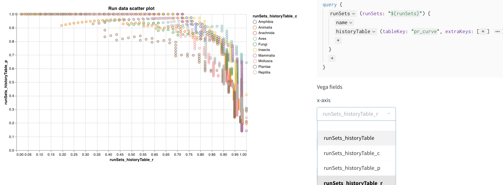

# Custom Charts Walkthrough

Para ir más allá de los gráficos incorporados en Weights & Biases, utiliza la nueva característica de los Gráficos Personalizados para controlar los detalles de qué datos vas a cargar exactamente en un panel y de cómo visualizar dichos datos.

 **Resumen**

1. Registra datos a W&B
2. Crea una consulta
3. Personaliza el gráfico

## 1. Registra datos a W&B

 Primero, registra los datos en tu script. Utiliza [wandb.config](https://docs.wandb.ai/library/config) para conjuntos de puntos simples al comienzo del entrenamiento, como hiperparámetros. Usa [wandb.log\(\)](https://docs.wandb.ai/library/log) para múltiples puntos a través del tiempo, y registra arreglos personalizados en 2D con wandb.Table\(\). Recomendamos registrar hasta 10.000 puntos de datos por clave registrada.

```python
# Logging a custom table of data
my_custom_data = [[x1, y1, z1], [x2, y2, z2]]
wandb.log({“custom_data_table”: wandb.Table(data=my_custom_data,
                                columns = ["x", "y", "z"])})
```

 [Prueba una notebok de ejemplo simple](https://bit.ly/custom-charts-colab) para registrar las tablas de datos, y en el próximo paso vamos a establecer los gráficos personalizados. Mira cómo se ven los gráficos resultantes en el [reporte en tiempo real](https://app.wandb.ai/demo-team/custom-charts/reports/Custom-Charts--VmlldzoyMTk5MDc).

## 2. Crea una consulta

Una vez que hayas registrado datos para visualizar, ve a la página del proyecto y haz click en el botón `+` para agregar un nuevo panel, y entonces selecciona Gráfico Personalizado. Puedes seguirlo en [este entorno de trabajo](https://app.wandb.ai/demo-team/custom-charts).


### Agrega una consulta

1.  Haz click en `summar`y y selecciona historyTable para establecer una nueva consulta que traiga datos desde el historial de la ejecución.
2. Escribe la clave donde registrarte wandb.Table\(\). En el fragmento de código anterior fue `my_custom_table`. En la [notebook de ejemplo](https://bit.ly/custom-charts-colab), las claves son `pr_curve` y `roc_curve`.

###  Establece los campos de Vega

Ahora que la consulta está cargada en estas columnas, estas están disponibles como opciones para seleccionar en los menús desplegable de los campos de Vega:



* **x-axis:** runSets\_historyTable\_r \(recall\)
* **y-axis:** runSets\_historyTable\_p \(precision\)
* **color:** runSets\_historyTable\_c \(class label\)

## 3. Personalizar el gráfico

Ahora esto se ve bastante bien, pero me gustaría cambiar de un gráfico de dispersión a un gráfico de líneas. Haz click en Editar para cambiar la especificación de Vega a la de este gráfico incorporado. Sigue en [este entorno de trabajo](https://app.wandb.ai/demo-team/custom-charts).


Actualicé la especificación de Vega para personalizar la visualización:

* agrega títulos para el gráfico, la leyenda, el eje x, y el eje y \(establece el “título” por cada campo\)
* cambia el valor de “mark” de “point” a “line”
* Elimina el campo “size” que no es usado


Para guardar esto como un preajuste que puedas usar en cualquier lugar del proyecto, has click en **Guardar como** en la parte superior de la página. Así es como se va a ver el resultado, conjuntamente con una curva ROC:


Gracias por continuar! Mándale un mensaje a Carey \([c@wandb.com](mailto:c@wandb.com)\) con preguntas y comentarios :\)[😊](https://emojipedia.org/smiling-face-with-smiling-eyes/)

## Extra: Compón Histogramas

 Los histogramas pueden visualizar distribuciones numéricas para ayudarnos a entender conjuntos de datos más grandes. Componer histogramas muestra múltiples distribuciones a través de los mismos contenedores, permitiéndonos comparar dos o más métricas a través de diferentes modelos, o a través de diferentes clases dentro de nuestro modelo. Para un modelo de segmentación semántica detectando objetos en una escena de conducción, podríamos comparar la efectividad de la optimización para la precisión versus el índice Jaccard \(IOU\), o podríamos querer conocer lo bien que los diferentes modelos detectan a los vehículos \(regiones grandes y comunes en los datos\) versus las señales de tráfico \(regiones mucho más pequeñas y menos comunes\). En la [Colab de la demostración](https://bit.ly/custom-charts-colab), puedes comparar la puntuación de la confianza para dos de las diez clases de las cosas vivientes.


 Para crear tu propia versión del panel del histograma compuesto personalizado:

1. Crea un nuevo panel de Gráficos Personalizados en tu Entorno de Trabajo o en tu Reporte \(al agregar una visualización de “Gráficos Personalizados”\). Presiona el botón “Editar” en la parte superior derecha para modificar la especificación de Vega, comenzando a partir de cualquier tipo de panel incorporado.
2.  Reemplaza esa especificación incorporada de Vega con mi [código MVP para un histograma compuesto en Vega](https://gist.github.com/staceysv/9bed36a2c0c2a427365991403611ce21). Puedes modificar el título principal, los títulos de los ejes, el dominio de la entrada, y cualquier otro detalle directamente en esta especificación de Vega, [utilizando la sintaxis de Vega](https://vega.github.io/) \(podrías cambiar los colores o incluso agregar un tercer histograma :\)\)
3. Modifica la consulta en el lado a mano derecha, para cargar los datos correctos desde tus registros de wandb. Agrega el campo “summaryTable” y establece el correspondiente “tableKey” a “class\_scores” para traer al wandb.Table registrado por tu ejecución. Esto te permitirá ingresar los datos en los dos conjuntos de contenedores \(“red\_bins” y “blue\_bins”\), a través de los menús desplegables, con las columnas de wandb.Table registradas como “class\_scores”. Para mi ejemplo, elegí las puntuaciones para la predicción de la clase “animal” para los contenedores rojos y “plant” para los contenedores azules.
4. Puedes seguir haciendo cambios a la especificación de Vega y seguir consultando hasta que estés feliz con el gráfico que veas en la vista previa. Una vez que hayas terminado, has click en “Guardar como”, en la parte superior, y dale un nombre a tu gráfico personalizado, para poder reutilizarlo. Entonces, haz click en “Aplicar desde la biblioteca del panel” para finalizar tu gráfico.

Aquí está cómo se ven mis resultados, a partir de un experimento muy breve: al entrenar solamente 1000 ejemplos por una época, se produce un modelo que está muy confiado de que la mayoría de las imágenes no son plantas, y muy inseguro respecto a qué imágenes podrían ser animales.


