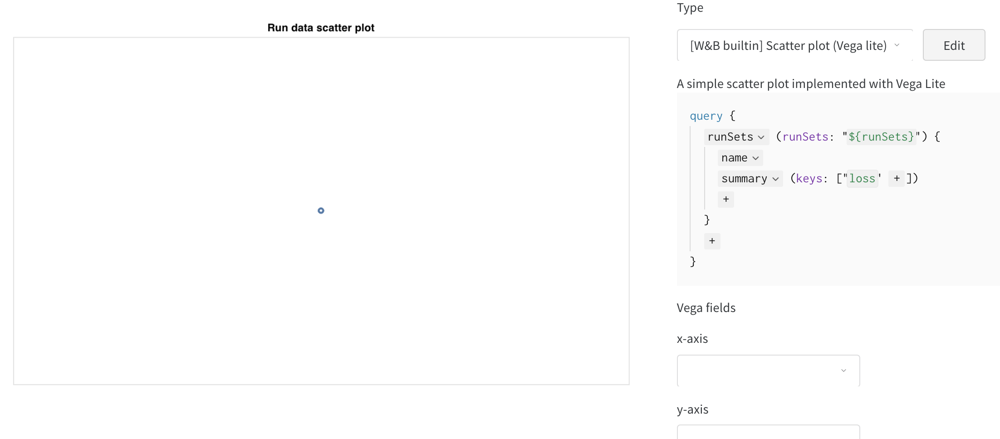
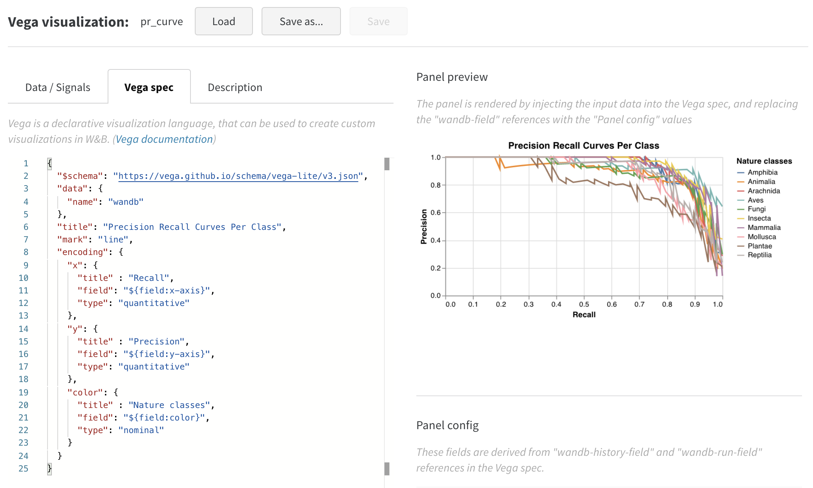
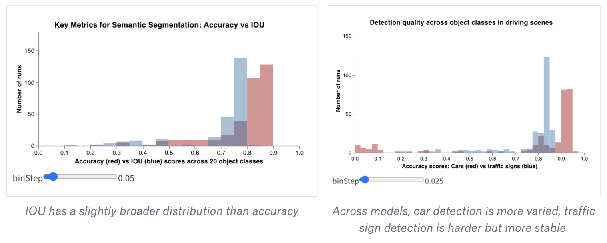

# Custom Charts Walkthrough

Pour aller plus loin que les graphiques préconstruits dans Weights & Biases, utilisez la nouvelle fonctionnalité **Graphiques Personnalisés** \(Custom Charts\) pour contrôler les détails exacts des données que vous chargez dans un panneau et de la manière dont vous visualisez ces données.

 **Vue d’ensemble**

1. Enregistrez des données sur W&B
2. Créez une requête
3. Personnalisez le graphique

## 1. Enregistrez des données sur W&B

Tout d’abord, enregistrez des données dans votre script. Utilisez [wandb.config](file:////library/config) pour des points uniques paramétrés au début de votre entraînement, comme les hyperparamètres. Utilisez [wandb.log\(\)](file:////library/log) pour des points multiples au fil du temps, et enregistrez des arrays 2D personnalisées avec wandb.Table\(\). Nous vous recommandons d’enregistrer un maximum de 10 000 points de données par clef enregistrée.  


```python
# Logging a custom table of data
my_custom_data = [[x1, y1, z1], [x2, y2, z2]]
wandb.log({“custom_data_table”: wandb.Table(data=my_custom_data,
                                columns = ["x", "y", "z"])})
```

[Essayez un exemple de notebook rapide](https://bit.ly/custom-charts-colab) pour enregistrer les tableaux de données, puis, à l’étape suivante, nous mettrons en place les graphiques personnalisés. Vous pouvez voir à quoi ressemblent les graphiques finaux dans le [rapport en direct.](https://app.wandb.ai/demo-team/custom-charts/reports/Custom-Charts--VmlldzoyMTk5MDc)

## 2. Créez une requête

Une fois que vous avez enregistré les données à visualiser, rendez-vous sur votre page de projet et cliquez sur le bouton `+` pour ajouter un nouveau panneau, puis sélectionnez Graphique Personnalisé \(Custom Chart\). Vous pouvez suivre les étapes dans [ce workspace](https://wandb.ai/demo-team/custom-charts?workspace=user-).



###  Ajouter une requête

1.   Cliquez sur `summary` et sélectionnez historyTable pour mettre en place une nouvelle requête qui extrait des données de l’historique d’essai.
2.  Inscrivez la clef où vous avez enregistré le **wandb.Table\(\)**. Dans l’extrait de code vu plus haut, c’était `my_custom_table` . Dans le [notebook d’exemple](https://bit.ly/custom-charts-colab), les clefs sont `pr_curve` et `roc_curve`. 

### Paramétrer les Champs Vega

Maintenant que la requête est chargée dans ces colonnes, elles sont disponibles comme options à sélectionner dans les menus déroulants de champs Vega :


* **x-axis:** runSets\_historyTable\_r \(recall\)
* **y-axis:** runSets\_historyTable\_p \(precision\)
* **color:** runSets\_historyTable\_c \(class label\)

## 3. Personnalisez le graphique

C’est déjà pas mal du tout, mais j’aimerais passer d’un nuage de points à un graphique linéaire. Cliquez sur **Éditer**pour changer les specs Vega pour ce graphique préconstruit. Suivez les étapes dans [ce workspace](https://app.wandb.ai/demo-team/custom-charts).


 J’ai mis à jour les specs Vega pour personnaliser le visuel :

* ajout de titres pour le graphique, la légende, l’axe-x, et l’axe-y \(paramétrez “title” pour chaque champ\)
* changement de la valeur de “mark” de “point” à “line”
*  retrait du champ “size” inutilisé



Pour sauvegarder ceci comme preset que vous pouvez utiliser n’importe où dans ce projet, cliquez sur **Enregistrer sous** \(Save as\) en haut de la page. Voici les résultats finaux, ainsi qu’une courbe ROC :


Merci d’avoir suivi ces étapes ! Envoyez un message à Carey \([c@wandb.com](mailto:c@wandb.com)\) pour vos questions et vos retours 😊

## Bonus : Histogrammes composites

 Les histogrammes peuvent visualiser les distributions numériques pour nous aider à comprendre de grands datasets. Les histogrammes composites montrent des distributions multiples dans les mêmes regroupements, nous permettant de comparer deux mesures ou plus à travers différents modèles ou à travers différentes classes à l’intérieur de notre modèle. Pour un modèle de segmentation sémantique qui détecte des objets dans des scénarios de conduite, nous pourrions comparer l’efficacité de l’optimisation pour la précision contre l’intersection sur l’union \(IOU\), ou nous pourrions nous demander comment les différents modèles détectent les voitures avec succès \(régions communes et grandes dans les données\) contre leur détection de signaux routiers \(régions beaucoup moins communes et beaucoup plus petite\). Dans la [démo Colab](https://bit.ly/custom-charts-colab), vous pouvez comparer le score de confiance de deux des dix classes de choses vivantes.



Pour créer votre propre version du panneau d’histogramme composite personnalisé :

1. Créez un nouveau panneau de Graphique Personnalisé dans votre Workspace ou sur la page Rapport \(en ajoutant la visualisation “Custom Chart”\). Appuyez sur le bouton “Edit” en haut à droite pour modifier les specs Vega, en commençant par tout type de panneau préconstruit.
2. Remplacez la spec Vega préconstruite avec [mon code MVP pour histogramme composite dans Vega](https://gist.github.com/staceysv/9bed36a2c0c2a427365991403611ce21). Vous pouvez modifier le titre principal, les titres des axes, le domaine d’input, et tout autre détail directement dans ce spec Vega en utilisant [la syntaxe Vega](https://vega.github.io/) \(vous pourriez changer les couleurs, ou même ajouter un troisième histogramme :\)
3. Modifiez la requête sur le côté droit pour charger les données correctes depuis vos enregistrements wandb. Ajoutez le champ “summaryTable” et paramétrez la “tableKey” correspondante sur “class\_scores” pour aller chercher le wandb.Table enregistré par votre essai. Cela vous permettra de peupler les deux sets de regroupements de l’histogramme \(“red\_bins” and “blue\_bins”\) via les menus déroulants avec les colonnes de wandb.Table enregistrées en tant que “class\_scores”. Pour mon exemple, j’ai choisi les scores de prédiction de la classe “animal” pour le regroupement rouge \(“red\_bins”\) et “plant” pour le regroupement bleu \(“blue\_bins”\).
4. Vous pouvez continuer à faire des changements à la spec Vega et à votre requête jusqu’à ce que vous soyez satisfait du graphique que vous pouvez voir dans le rendering de prévisualisation. Une fois que vous avez fini, cliquez sur “Save as” en haut et donnez un nom à votre graphique personnalisé pour pouvoir le réutiliser. Puis, cliquez sur “Apply from panel library” \(Appliquer depuis la librairie de panneaux\) pour finir votre graphique.

Voici l’aspect de mes résultats issus d’une très brève expérience : s’entraîner sur seulement 1 000 exemples pour une epoch donne un modèle qui est très confiant que la plupart des images ne sont pas des plantes, et qui est très incertain pour discerner quelles images pourraient être des animaux.


