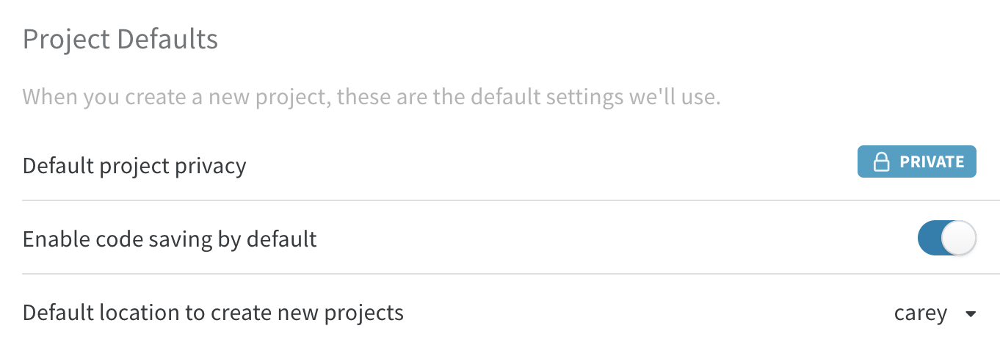

# Code Saving

 デフォルトでは、最新のgit commitハッシュのみを保存します。より多くのコード機能をオンにして、UIで実験間のコードを動的に比較できます。

 `wandb`バージョン0.8.28以降、`wandb.init（）`を呼び出すメイントレーニングファイルからコードを保存できます。これはダッシュボードに同期され、実行ページのタブとコード比較パネルに表示されます。[設定ページ](https://wandb.ai/settings)に移動して、デフォルトでコード保存を有効にします。

##  コード比較

### ワークスペースまたはレポートの\[+\]ボタンをクリックして新しいパネルを追加し、コード比較ツールを選択します。プロジェクト内の2つの実験を比較して、コードのどの行が変更されたかを正確に確認します。次に例を示します。

## Jupyterセッション履歴

**wandb**バージョン0.8.34以降、ライブラリはJupyterセッションの保存を行います。Jupyter内で**wandb.init（）**を呼び出すと、現在のセッションで実行されたコードの履歴を含むJupyterノートブックを自動的に保存するフックが追加されます。このセッション履歴は、コードディレクトリの下の実行ファイルブラウザで見つけることができます。

 このファイルをクリックすると、セッションで実行されたセルと、iPythonのdisplayメソッドを呼び出して作成された出力が表示されます。これにより、特定の実行でJupyter内で実行されたコードを正確に確認できます。可能であれば、コードディレクトリにある最新バージョンのノートブックも保存します。

## Jupyter diffing

最後のボーナス機能の1つは、ノートブックを比較する機能です。コード比較パネルに生のJSONを表示する代わりに、各セルを抽出して、変更された行を表示します。Jupyterをプラットフォームにさらに深く統合するためのいくつかのエキサイティングな機能が計画されています。

