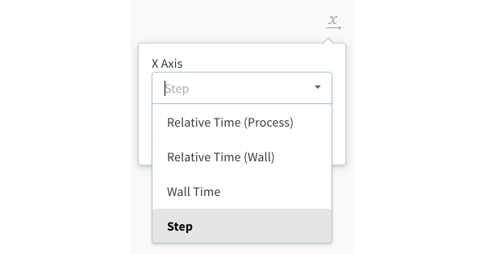
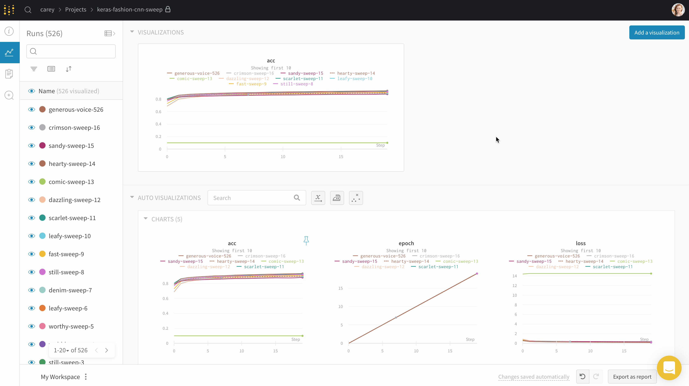
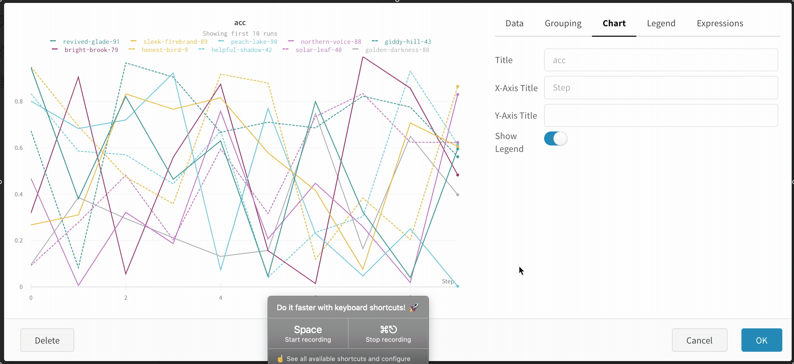

# Line Plot

**wandb.log\(\)**を使用して時間の経過とともにメトリックをプロットすると、デフォルトでラインプロットが表示されます。チャート設定でカスタマイズして、同じプロット上の複数の線を比較し、カスタム軸を計算し、ラベルの名前を変更します。

## **設定**

**データ**

*  **X軸**：ステップと相対時間を含むデフォルトのX軸を選択するか、カスタムX軸を選択します。カスタムx軸を使用する場合は、y軸のログに使用するのと同じwandb.log（）の呼び出しにログインしていることを確認してください。
* **相対時間（Wall）**は、プロセスが開始されてからの時間です。したがって、実行を開始して1日後に再開し、24時間プロットされるものをログに記録した場合。
* **相対時間（プロセス）**は実行中のプロセス内の時間であるため、実行を開始して10秒間実行し、1日後に再開した場合、そのポイントは10秒でプロットされます。
* **実測時間**は、グラフの最初の実行の開始から経過した分です。
* **ステップ**は、wandb.log（）が呼び出されるたびにデフォルトで増分され、モデルからログに記録したトレーニングステップの数を反映することになっています。
* **Y軸**：時間の経過とともに変化するメトリックやハイパーパラメータなど、ログに記録された値からY軸を選択します。
* **最小、最大、および対数スケール**：ラインプロットのx軸とy軸の最小、最大、および対数スケールの設定
* **外れ値の平滑化と除外**：折れ線グラフの平滑化を変更するか、再スケーリングして、デフォルトのプロットの最小および最大スケールから外れ値を除外します
*  **表示する最大実行数**：この数を増やすと、折れ線グラフに一度に多くの線が表示されます。デフォルトでは10実行です。使用可能な実行数が10を超えているが、グラフが表示される数を制限している場合は、グラフの上部に「最初の10回の実行を表示しています」というメッセージが表示されます。
* **グラフの種類**：折れ線グラフ、面積プロット、およびパーセンテージ面積プロット間の変更

**X軸の設定X軸**は、グラフレベルで設定することも、プロジェクトページまたはレポートページでグローバルに設定することもできます。グローバル設定は次のようになります。


折れ線グラフの設定で**複数のy軸**を選択し、精度や検証精度など、同じグラフ上のさまざまな指標を比較します。


**グループ化**

* グループ化をオンにして、平均値を視覚化するための設定を確認します。 
* **グループキー**：列を選択すると、その列で同じ値を持つすべての実行がグループ化されます。
* **Agg**：Aggregation‐グラフ上の線の値。オプションは、グループの平均、中央値、最小、および最大です。
*  **範囲**：グループ化された曲線の背後にある影付きの領域の動作を切り替えます。なしは、影付きの領域がないことを意味します。最小/最大は、グループ内のポイントの全範囲をカバーする影付きの領域を示しています。Std Devは、グループ内の値の標準偏差を示します。Std Errは、標準誤差を影付きの領域として示しています。
*  **サンプリングされた実行**：数百の実行が選択されている場合、デフォルトでは最初の100のみがサンプリングされます。すべての実行をグループ化の計算に含めるように選択できますが、UIの処理が遅くなる可能性があります。

**凡例**·       

* **タイトル**：折れ線グラフのカスタムタイトルを追加します。これはグラフの上部に表示されます·      
* **X軸のタイトル**：折れ線グラフのx軸にカスタムタイトルを追加します。これは、グラフの右下隅に表示されます。
* **Y軸のタイトル**：折れ線グラフのY軸にカスタムタイトルを追加します。これは、グラフの左上隅に表示されます。
* **凡例**：各線のプロットの凡例に表示するフィールドを選択します。たとえば、実行の名前と学習率を表示できます。
* **凡例テンプレート**：完全にカスタマイズ可能なこの強力なテンプレートを使用すると、折れ線グラフの上部にあるテンプレートに表示するテキストと変数、およびプロットの上にマウスを置いたときに表示される凡例を正確に指定できます。

**軸式**：計算されたメトリックをグラフに追加します。ログに記録されたメトリックとハイパーパラメータなどの構成値を使用して、カスタム行を計算できます。

 **X軸式**：カスタム式を使用して計算値を使用するようにx軸を再スケーリングします。便利な変数include\_**step**はデフォルトのx軸であり、要約値を参照するためのシンタックスは${summary:value}です。

**軸式**：計算されたメトリックをグラフに追加します。ログに記録されたメトリックとハイパーパラメータなどの構成値を使用して、カスタム行を計算できます。·     

  **X軸式**：カスタム式を使用して計算値を使用するようにx軸を再スケーリングします。便利な変数include\_**step**はデフォルトのx軸であり、要約値を参照するためのシンタックスは${summary:value}です。

Here I have grouped the lines to see the average value across runs.

## Compare two metrics on one chart

 **1つのグラフで2つの指標を比較します**実行をクリックして、実行ページに移動します。これは、Stacey氏のEstuaryプロジェクトからの[実行](https://wandb.ai/stacey/estuary/runs/9qha4fuu?workspace=user-carey)例です。自動生成されたグラフには、単一の指標が表示されます。 

  
ページの右上にある\[**ビジュアライゼーションの追加**\]をクリックして、**折れ線プロット**を選択します。

In the **Y variables** field, select a few metrics you'd like to compare. They'll show up together on the line graph.

## **異なるx軸で視覚化します**

  
実験にかかった絶対時間を確認したい場合、または実験が実行された日を確認したい場合は、x軸を切り替えることができます。これは、ステップから相対時間、そして実測時間に切り替える例です。

## **エリアプロット**

折れ線グラフの設定の\[詳細設定\]タブで、さまざまなプロットスタイルをクリックして、面積プロットまたはパーセント面積プロットを取得します。

##  **ズーム**

長方形をクリックしてドラッグすると、垂直方向と水平方向に同時にズームできます。これにより、x軸とy軸のズームが変更されます。

## **グラフの凡例を非表示**

この単純なトグルで折れ線グラフの凡例をオフにします。

