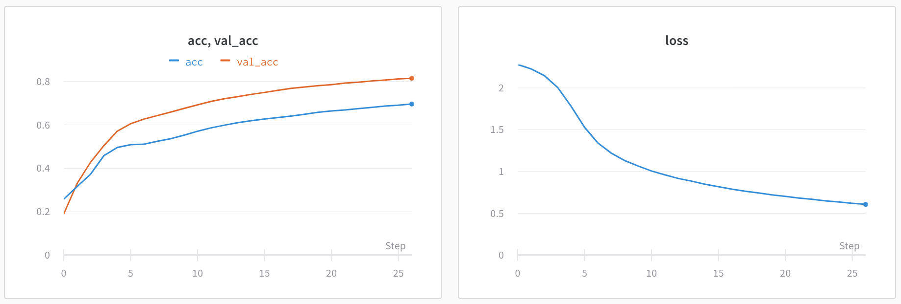
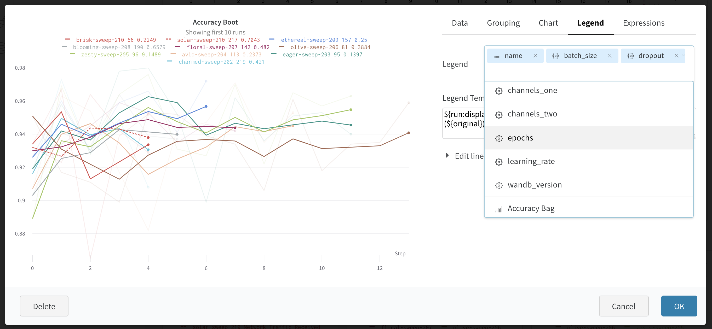
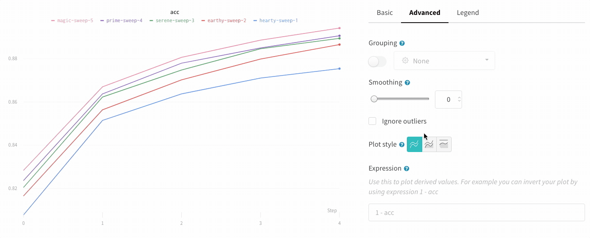

# Line Plot

Les graphiques linéaires s’affichent par défaut lorsque vous enregistrez des mesures au fil du temps avec **wandb.log\(\)**. Personnalisez vos paramètres de graphique pour comparer plusieurs lignes sur le même graphique, calculer des axes personnalisés, et renommer des libellés.

##  Paramètres

**Data \(données\)**

*  **X axis :** Sélectionnez un axe-x par défaut, comme Step \(Étape\) ou Relative Time \(Temps relatif\) ou sélectionnez un axe-x personnalisé. Si vous voulez utiliser un axe personnalisé, assurez-vous qu’il soit enregistré dans le même appel à `wandb.log()` que celui que vous utilisez pour enregistrer l’axe-y. 
  *  **Relative Time \(Wall**\) est le temps en heures depuis lequel le processus a commencé, donc, si vous commencez un essai et que vous le reprenez un jour plus tard en enregistrant quelque chose, le point s’affichera à 24h.
  * **Relative Time \(Process**\) est le temps à l’intérieur du processus de calcul, donc si vous commencez un essai qui dure dix secondes, et que vous reprenez un jour plus tard, le point s’affichera à 10s.
  * **Wall Time** représente les minutes passées depuis le début du premier essai sur le graphique
  * **Step** incrémente par défaut à chaque fois que `wandb.log()` est appelé, et est censé refléter le nombre d’étapes d’entraînement que vous avez enregistré depuis votre modèle
*  **Y axes** : Sélectionnez des axes y parmi les valeurs enregistrées, ce qui inclue les mesures et les hyperparamètres qui changent au fil du temps.
* **Min, max, and log scale** : Paramètres de minimum, de maximum, et d’échelle logarithmique pour les axes x et y dans des graphiques linéaires
* **Smoothing and exclude outliers** : Changez le lissage du graphique linéaire ou remettez à l’échelle pour exclure les données aberrantes des échelles min et max du graphique par défaut
* **Max runs to show :** Affichez plus de lignes sur le graphique linéaire d’un coup en augmentant ce nombre, qui est par défaut réglé sur 10 essais. Vous verrez le message "Showing first 10 runs" \(10 premiers essais affichés\) en haut du graphique s’il y a plus de 10 essais disponibles, mais que le graphique restreint le nombre d’essais visibles.
*      **Chart type :** Changez entre graphique linéaire, graphique en aires, graphique en aires par pourcentage.

**Paramètres d’axe X**  
L’axe X peut être paramétré au niveau du graphique, ainsi que de manière globale pour la page de projet ou la page de rapport. Voici ce à quoi ressemblent les paramètres globaux :


Choisissez **plusieurs axes y** dans les paramètres de graphique linéaire pour comparer différentes mesures sur le même graphique, comme la précision et la précision de validation, par exemple.


 **Grouping \(regroupements\)**

*     **Activez les regroupements pour voir les paramètres de visualisation des valeurs moyennes.**
*       **Group key : Sélectionnez une colonne, et tous les essais avec la même valeur dans cette colonne seront regroupés ensemble.**
* **Agg : Agrégation – la valeur de la ligne sur le graphique. Les options sont moyenne, médiane, min et max du groupe.**
* **Range : Changez le comportement de la zone ombrée derrière la courbe regroupée. None signifie qu’il n’y a pas de zone ombrée. Min/Max montre une région ombrée qui couvre l’intégralité des points dans ce groupe. Std Dev montre la déviation standard des valeurs de ce groupe. Std Err montre l’erreur standard comme la zone ombrée.**
* **Sampled runs : Si vous avez des centaines d’essais sélectionnés, nous n’échantillonnons que les 100 premiers par défaut. Vous pouvez choisir d’avoir tous vos essais inclus dans le calcul de regroupement, mais il est possible que ça ralentisse les choses dans l’IU.**

**Legend \(légende\)**

*   **Title : Ajoute un titre personnalisé pour le graphique linéaire, affiché en haut du graphique**
*  **X-Axis title : Ajoute un titre personnalisé pour l’axe X du graphique linéaire, qui s’affiche en bas à droite du graphique.**
*  **Y-Axis title : Ajoute un titre personnalisé pour l’axe Y du graphique linéaire, qui s’affiche en haut à gauche du graphique.**
*  **Legend : Sélectionnez un champ que vous voulez voir dans la légende du graphique pour chaque ligne. Par exemple, vous pouvez montrer le nom de votre essai et le taux d’apprentissage.**
* **Legend template : Totalement personnalisable, ce document-type puissant vous permet de spécifier exactement quel texte et quelles variables vous voulez afficher dans le document-type en haut du graphique linéaire ainsi que la légende qui apparaît lorsque vous passez votre souris au-dessus du graphique.**

 **Expressions**

* Y Axis Expressions : Ajoutez des mesures calculées à votre graphique. Vous pouvez utiliser n’importe lesquelles de vos mesures enregistrées, ainsi que des valeurs de configuration comme des hyperparamètres pour calculer des lignes personnalisées.
* X Axis Expressions : Changez l’échelle de l’axe x pour utiliser les valeurs calculées comme expressions personnalisées. Certaines variables utiles sont \_step pour l’axe x par défaut, et la syntaxe pour référence aux valeurs du sommaire est `${summary:value}`

## Visualiser des valeurs moyennes sur un graphique

Si vous avez plusieurs expériences différentes et que vous aimeriez voir la moyenne de leurs valeurs sur un graphique, vous pouvez utiliser la fonctionnalité de Regroupement du tableau. Cliquez sur "Group" dans le tableau d’essai et sélectionnez "All" pour montrer les valeurs moyennes dans vos graphiques.

Voici ce à quoi ressemble le graphique avant de faire la moyenne :

Ici, j’ai regroupé les lignes pour voir la valeur moyenne à travers les essais.

## Comparer deux mesures sur un graphique

Cliquez sur un essai pour vous rendre sur la page d’essai. Voici un [exemple d’essai](https://app.wandb.ai/stacey/estuary/runs/9qha4fuu?workspace=user-carey) du projet Estuary de Stacey. Les graphiques générés automatiquement montrent des mesures simples.

 Cliquez sur **Add a visualization** \(ajouter un visuel\) en haut à droite de la page, et sélectionnez le **Line plot** \(graphique linéaire\).

Dans le champ de **variables Y**, sélectionnez quelques mesures que vous voudriez comparer. Elles s’afficheront ensemble sur le graphique linéaire.

##  Visualiser sur des axes x différents

Si vous aimeriez voir le temps absolu qu’une expérience a pris, ou le jour auquel une expérience a été exécutée, vous pouvez changer l’axe x. Voici un exemple où on change les **Steps** en **Relative time**, puis en **Wall time**.

### Graphiques en aires

 Dans les paramètres de graphique linéaire, dans l’onglet Advanced, cliquez sur les différents types de graphiques pour obtenir un graphique en aires ou un graphique en aires par pourcentage.

## Zoom

Cliquez et dessinez un rectangle avant de relâcher pour zoomer verticalement et horizontalement à la fois. Ceci modifie le zoom de l’axe x et de l’axe y.

##  Cacher la légende du graphique

Désactivez la légende sur le graphique avec ce simple bouton :

