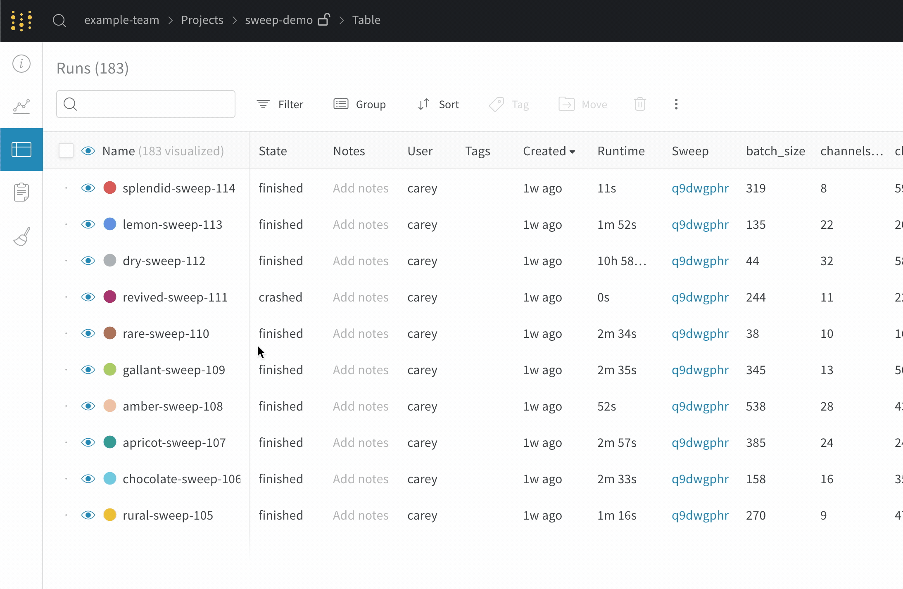

# Table

プロジェクトページでは、実行がサイドバーに表示されます。サイドバーを展開して、実行全体のハイパーパラメータとサマリーメトリックの表を表示します。

## **実行名を検索**

表内の実行名の完全な[正規表現](https://dev.mysql.com/doc/refman/8.0/en/regexp.html)検索をサポートします。検索ボックスにクエリを入力すると、ワークスペースのグラフに表示されている実行がフィルタリングされ、表の行もフィルタリングされます。

## **サイドバーのサイズを変更します**

プロジェクトページのグラフ用にもっとスペースを作りたいですか？列ヘッダーの端をクリックしてドラッグし、サイドバーのサイズを変更します。目のアイコンをクリックして、グラフの実行をオンまたはオフにすることはできます。

##  **サイドバー列を追加します**

プロジェクトページでは、実行がサイドバーに表示されます。より多くの列を表示する方法：

1. サイドバーの右上隅にあるボタンをクリックして、表を展開します。
2. 列ヘッダーで、ドロップダウンメニューをクリックして列を固定します。
3. 表を折りたたむと、サイドバーに固定された列が表示されます。

これがスクリーンキャプチャです。表を展開し、2つの列を固定し、表を折りたたんでから、サイドバーのサイズを変更します。

## **一括選択実行**

複数の実行を一度に削除するか、実行のグループにタグを付けます。一括選択により、実行表を整理しやすくなります。

## **表内のすべての実行を選択します**

表の左上隅にあるチェックボックスをクリックし、\[すべての実行を選択\]をクリックして、現在のフィルターのセットに一致するすべての実行を選択します。

## **プロジェクト間で実行を移動します**

実行をあるプロジェクトから別のプロジェクトに移動する方法：

1. 表を展開します
2. 移動する実行の横にあるチェックボックスをクリックします
3. \[移動\]をクリックして、宛先プロジェクトを選択します

## **アクティブな実行を参照します**

実行の名前の横にある緑色の点を探します。これは、実行が表とグラフの凡例でアクティブであることを示します。

##  **望ましくない実行を隠します**

クラッシュした実行を非表示にしたいですか？ショート実行はあなたの表をいっぱいにしていますか？グループプロジェクトでの作業のみを表示しますか？フィルターでノイズを隠します。おすすめのフィルター：

* **私の作業のみ**をフィルターして、ユーザー名で実行する
* **クラッシュした実行を非表示**にして、クラッシュとマークされた実行を表から除外する
* **期間**：新しいフィルターを追加し、「期間」を選択して短期間の実行を非表示にする

## **不要な実行をフィルタリングして削除します**

表を削除したいものだけに絞り込む場合は、すべてを選択し、削除を押してプロジェクトから削除できます。実行の削除はプロジェクトグローバルであるため、レポートから実行を削除すると、プロジェクトの残りの部分に反映されます。

##  **実行表をCSVにエクスポート**

ダウンロードボタンを使用して、すべての実行、ハイパーパラメータ、およびサマリーメトリックの表をCSVにエクスポートします。

