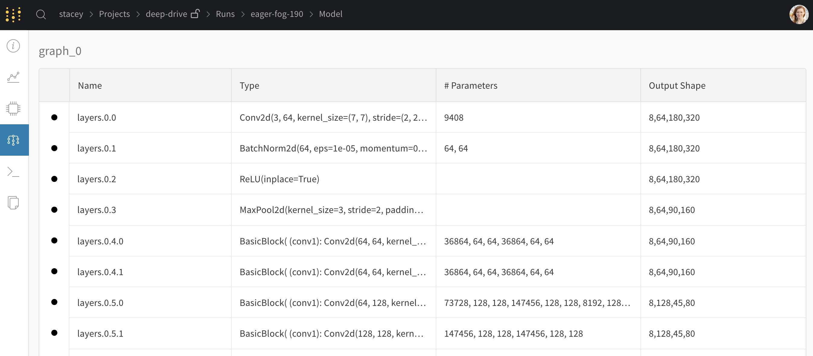
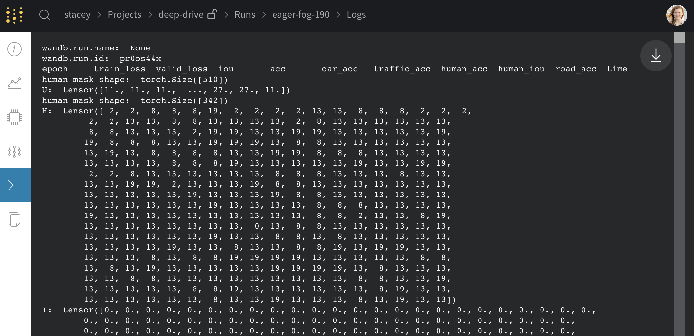

# Run Page

Usa la página de la ejecución para explorar la información detallada acerca de una versión simple de tu modelo.

## Pestaña Resumen

* Nombre, descripción y etiquetas de la ejecución
* Nombre del host, sistema operativo, versión de Python, y comando que lanzó la ejecución
* Lista de los parámetros de configuración guardados con [wand](https://docs.wandb.ai/library/config)[b](https://docs.wandb.ai/library/config)[.config](https://docs.wandb.ai/library/config).
* Lista de los parámetros de la síntesis guardados con [wandb.log\(\)](https://docs.wandb.ai/library/log), establecido por defecto al último valor registrado

 [Ver un ejemplo en tiempo real →](https://app.wandb.ai/carey/pytorch-cnn-fashion/runs/munu5vvg/overview?workspace=user-carey)

Los detalles de Python son privados, incluso si haces que la página sea de uso público. Aquí hay un ejemplo de mi página de ejecuciones en modo incógnito a la izquierda, y mi cuenta a la derecha.

## Pestaña Gráficos

* Busca, agrupa y arregla las visualizaciones
* Haz click sobre el ícono✏️  del lápiz sobre un gráfico para editarlo
  * Cambia el eje x, las métricas y los rangos
  * edita las leyendas, los títulos y los colores de los gráficos
* Mira predicciones de los ejemplos desde tu conjunto de validación
* Para obtener estos gráficos, registra los datos con [wandb.log\(\)](https://docs.wandb.ai/library/log)

[Ver un ejemplo en tiempo real →](https://app.wandb.ai/wandb/examples-keras-cnn-fashion/runs/wec25l0q?workspace=user-carey)

## Pestaña Sistema

* Visualiza la utilización de la CPU, la memoria del sistema, la entrada/salida del disco, el tráfico de red, la utilización de la GPU, la temperatura de la GPU, el tiempo de la GPU gastado en acceder a la memoria, la memoria asignada a la GPU, y el uso de la potencia de la GPU.
*  Lambda Labs destacó cómo utilizar las métricas del sistema de W&B en un [artículo del blog →](https://lambdalabs.com/blog/weights-and-bias-gpu-cpu-utilization/)

 [Ver un ejemplo en tiempo real →](https://wandb.ai/stacey/deep-drive/runs/ki2biuqy/system?workspace=user-carey)

### Pestaña Modelo

* Mira las capas de tu modelo, el número de parámetros, y la forma de la salida de cada capa.

[Ver un ejemplo en tiempo real →](https://app.wandb.ai/stacey/deep-drive/runs/pr0os44x/model)

## Pestaña Registros

* Salida impresa en la línea de comandos, el stdout y el stderr de la máquina entrenando al modelo
* Mostramos las últimas 1000 líneas. Después de que la ejecución ha finalizado, si quisieras descargar el archivo del registro completo, haz click en el botón descarga, en la esquina superior derecha.

[Ver un ejemplo en tiempo real →](https://app.wandb.ai/stacey/deep-drive/runs/pr0os44x/logs)

## Pestaña Archivos

* Guarda los archivos para sincronizarlos con la ejecución usando [wandb.save\(\)](https://docs.wandb.ai/library/save)
* Mantén los puntos de control del modelo, los ejemplos del conjunto de validación, y más
* Utiliza el diff.patch para [restituir](https://docs.wandb.ai/library/restore) la versión exacta de tu código

🌟 Nueva recomendación: Prueba los [Art](https://docs.wandb.ai/artifacts)[e](https://docs.wandb.ai/artifacts)[fact](https://docs.wandb.ai/artifacts)[o](https://docs.wandb.ai/artifacts)[s](https://docs.wandb.ai/artifacts) para hacer el seguimiento de las entradas y de las salidas.

[Ver un ejemplo en tiempo real →](https://app.wandb.ai/stacey/deep-drive/runs/pr0os44x/files/media/images)

