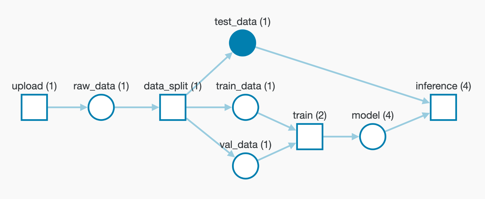

# Artifacts

Utilisez les artefacts W&B pour stocker et garder une trace de vos datasets, de vos modèles, et de vos résultats d’évaluation à travers vos pipelines d’apprentissage automatique. Pensez à un artefact comme à un fichier versionné de données. Vous pouvez stocker des datasets entiers directement dans les artefacts, ou utiliser des références artefacts pour pointer vers des données dans d’autres systèmes.

 [Explorez un exemple d’Artefacts](https://wandb.ai/wandb/arttest/reports/Artifacts-Quickstart--VmlldzozNTAzMDM) pour le versioning de dataset et la gestion de modèle avec un notebook rapide et interactif, hébergé dans Google Colab.



## Bien commencer

[](http://wandb.me/artifacts-quickstart)

### 1. Enregistrer un artefac

Initialisez un essai et enregistrez un artefact, par exemple une version du dataset que vous utilisez pour entraîner un modèle.

```python
run = wandb.init(job_type="dataset-creation")
artifact = wandb.Artifact('my-dataset', type='dataset')
artifact.add_file('my-dataset.txt')
run.log_artifact(artifact)
```

### 2.  Utiliser l’artefact

Commencez un nouvel essai et demandez l’artefact sauvegardé, par exemple pour utiliser le dataset pour entraîner un modèle.

```python
run = wandb.init(job_type="model-training")
artifact = run.use_artifact('my-dataset:latest')
artifact_dir = artifact.download()
```

### 3.  Enregistrer une nouvelle version

Si un artefact change, exécutez de nouveau le même script de création d’artefact. Dans ce cas, imaginons que les données dans le fichier my-dataset.txt changent. Le même script capturera précisément la nouvelle version – nous ferons une somme de contrôle de l’artefact, identifierons que quelque chose a changé, et nous garderons une trace de la nouvelle version. Si rien n’a changé, nous ne téléchargerons aucune donné et ne nous créerons pas de nouvelle version.

```python
run = wandb.init(job_type="dataset-creation")
artifact = wandb.Artifact('my-dataset', type='dataset')
# Imagine more lines of text were added to this text file:
artifact.add_file('my-dataset.txt')
# Log that artifact, and we identify the changed file
run.log_artifact(artifact)
# Now you have a new version of the artifact, tracked in W&B
```

##  Comment ça fonctionne

 En utilisant notre API Artifacts, vous pouvez enregistrer des artefacts comme sorties \(output\) de vos essais W&B, ou utiliser nos artefacts comme entrées \(input\) de vos essais.


Puisqu’un essai peut utiliser l’artefact de sortie d’un autre essai comme entrée, les artefacts et les essais ensembles forment un graphique orienté. Vous n’avez pas besoin de définir de pipelines en avance. Utilisez et enregistrez simplement les artefacts, et nous recouperons tout de notre côté.

Voici un [exemple d’artefact](https://app.wandb.ai/shawn/detectron2-11/artifacts/model/run-1cxg5qfx-model/4a0e3a7c5bff65ff4f91/graph) où vous pouvez voir la vue résumée par le Graphe Orienté Acyclique \(DAG\), ainsi que la vue dézoomée de toutes les exécutions de chaque étape et toutes les versions d’artefact.


 Pour apprendre à utiliser les Artefacts, consultez la [docu Artifacts API →](https://docs.wandb.com/artifacts/api)

##  Tutoriel vidéo pour les Artefacts W&B

 Suivez notre[ tutoriel](https://www.youtube.com/watch?v=Hd94gatGMic) interactif et apprenez comment faire le suivi de vos pipelines d’apprentissage avec les Artefacts W&B.


