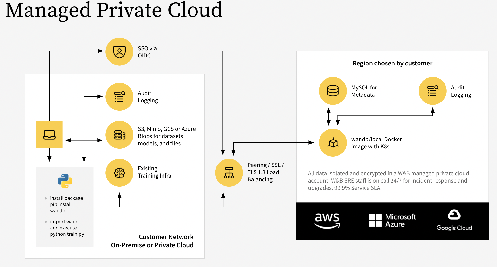

# Local

Use W\&B Local to self-host the Weights & Biases app. You can run the app locally or host in a private cloud. For serious work, we encourage you to set up and manage a scalable file system. For enterprise customers, we provide extensive technical support and frequent installation updates for self-hosted instances.

The self hosted server is a single Docker image that is simple to deploy. Your W\&B data is saved on a persistent volume or an external database so data can be preserved across container versions. The server requires an instance with **at least 4 cores and 8GB memory**.

## Starting the server

To run the W\&B server locally you'll need to have [Docker](https://www.docker.com/products/docker-desktop) installed. Then simply run:

```
wandb local
```

Behind the scenes the wandb client library is running the [_wandb/local_](https://hub.docker.com/repository/docker/wandb/local) docker image, forwarding port 8080 to the host, and configuring your machine to send metrics to your local instance instead of our hosted cloud. If you want to run our local container manually, you can run the following docker command:

```
docker run --rm -d -v wandb:/vol -p 8080:8080 --name wandb-local wandb/local
```

## Centralized Hosting

Running wandb on localhost is great for initial testing, but to leverage the collaborative features of _wandb/local_ you should host the service on a central server. Instructions for setting up a centralized server on various platforms can be found in the [Production Setup](setup.md) section.




**Danger of Data Loss**

**Use a scalable file system** for any serious production work. As you log more data, your storage requirements will increase. Allocate space ahead of time, and set up alerts so you can resize the file system as your usage increases.


## Basic Configuration

**Quick test configuration**

Running `wandb local` configures your local machine to push metrics to [http://localhost:8080](http://localhost:8080). If you want to host local on a different port you can pass the `--port` argument to wandb local. If you've configure DNS with your local instance you can run: `wandb login --host=http://wandb.myhost.com` on any machines that you want to report metrics from. You can also set the `WANDB_BASE_URL` environment variable to a host or IP on any machines you wish to report to your local instance. In automated environment you'll also want to set the `WANDB_API_KEY` environment variable within an api key from your settings page. To restore a machine to reporting metrics to our cloud hosted solution, run `wandb login --host=https://api.wandb.ai`.

**Scalable configuration**

While W\&B can be used by leveraging the persistent volume mounted to /vol as stated above, this solution is not meant for production workloads. If you decide to use W\&B in this way, it is recommended that enough space be allocated ahead of time to store current and future needs of metrics and strongly suggested that the underlying file store can be resized as needed. In addition, alerts should be put in place to let you know once minimum storage thresholds are crossed to resize the underlying file system.

### Authentication

The base install of _wandb/local_ will automatically prompt you to create an initial user, the first time you start it up. Contact us at support@wandb.com to request a free upgrade to your license, from 1 user to 3 users.

### Persistence and Scalability

All metadata and files sent to W\&B are stored in the `/vol` directory. If you do not mount a persistent volume at this location all data will be lost when the docker process dies.

If you purchase a license for _wandb/local_, you can store metadata in an external MySQL database and files in an external storage bucket removing the need for a stateful container as well as giving you the necessary resilience and scalability features typically necessary for production workloads.

While W\&B can be used by leveraging the persistent volume mounted to `/vol` as stated above, this solution is not meant for production workloads. If you decide to use W\&B in this way, it is recommended that enough space be allocated ahead of time to store current and future needs of metrics and strongly suggested that the underlying file store can be resized as needed. In addition, alerts should be put in place to let you know once minimum storage thresholds are crossed to resize the underlying file system.

For trial purposes, we recommend at least 100GB free space in the underlying volume for non image/video/audio heavy workloads. If testing W\&B with large files, the underlying store needs to have enough space to accommodate those needs. In all cases, the space allocated needs to reflect the metrics and outputs of your workflows.

### Upgrades

We are pushing new versions of _wandb/local_ to dockerhub regularly. To upgrade you can run:

```
$ wandb local --upgrade
```

To upgrade your instance manually you can run the following

```
$ docker pull wandb/local
$ docker stop wandb-local
$ docker run --rm -d -v wandb:/vol -p 8080:8080 --name wandb-local wandb/local
```

### Getting a license

If you're interested in configuring teams, using external storage, or deploying wandb/local to a Kubernetes cluster send us an email at [contact@wandb.com](mailto:contact@wandb.com)
