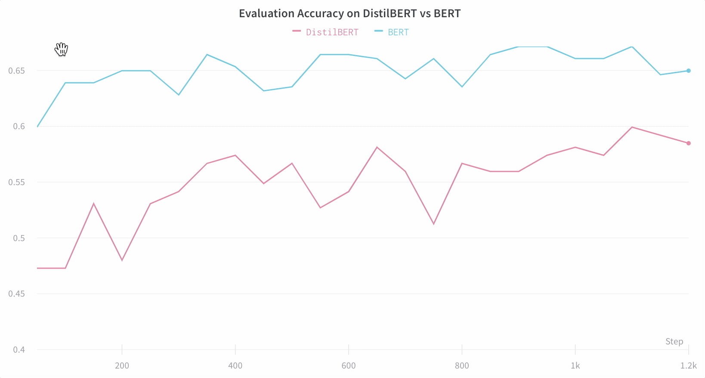

# Hugging Face

Hugging Face[トランスフォーマーライブラリ](https://github.com/huggingface/transformers)の、Weights & Biasesインテグレーション: NLP問題の解決 - 記録した実行を一度に解決する。


[**ここをクリック**](https://discuss.huggingface.co/t/weights-biases-supporting-wave2vec2-finetuning/4839)**すると、Weights & Biasesが Hugging Face Wav2vec2-XLSRのコミュニティチャレンジでどのように役立つかをご覧いただけます。また、**[ **XLSR Colab**](https://colab.research.google.com/drive/1oqMZAtRYkurKqePGxFKpnU9n6L8Qk9hM?usp=sharing) **では、Hugging FaceとWeights & Biasesの使用例をご覧いただけます**


## **コードが見たい**

* こちらをご覧ください。[**W&BとHugging FaceのGoogle Colabデモ**](http://wandb.me/hf)

### **Weights & Biasesを使用して、Hugging Faceモデルをすばやく簡単にトラッキング**

以下は[BERTとDistilbert](https://app.wandb.ai/jack-morris/david-vs-goliath/reports/Does-model-size-matter%3F-Comparing-BERT-and-DistilBERT-using-Sweeps--VmlldzoxMDUxNzU)の比較例です。さまざまなアーキテクチャがトレーニング全体の評価精度にどのように影響するかを、ラインプロットの自動視覚化で簡単に確認できます。ご自身のHugging Faceモデルのトラッキングと保存がいかに簡単であるか、お分かりいただけると思います。



 上記は、[BERT と Distilbert](https://app.wandb.ai/jack-morris/david-vs-goliath/reports/Does-model-size-matter%3F-Comparing-BERT-and-DistilBERT-using-Sweeps--VmlldzoxMDUxNzU) を比較した例です。ラインプロットの自動視覚化を使用して、トレーニング全体でさまざまなアーキテクチャが評価精度にどのように影響するかを簡単に確認できます。この記事をぜひ最後までお読みください。ご自身のHugging Faceモデルのトラッキングや保存がいかに簡単であるか、お分かりいただけると思います。

## **このガイドの内容**

ここでは、次の内容について説明します：

* W&BとHugging Faceトランスフォーマーを使用した**ノートブックの例**
* **はじめに**：W&B とトランスフォーマによるモデルのトラッキングと保存
* **W&B の高度な設定**
  * 追加設定
  * wandb.init のカスタマイズ

## **実例のNotebook**

ここでは、 W&B のインテグレーションの仕組みについていくつかの例を作成しました。

* モデルロギングを使用したGoogle Colabでの[**W&BとHugging Faceデモ**](http://wandb.me/hf)
* [**Huggingtweets**](https://wandb.ai/wandb/huggingtweets/reports/HuggingTweets-Train-a-Model-to-Generate-Tweets--VmlldzoxMTY5MjI)　- GPT-2 Hugging Faceモデルをトレーニングしてツイートを生成
* [**モデルのサイズの重要性について**](https://app.wandb.ai/jack-morris/david-vs-goliath/reports/Does-model-size-matter%3F-A-comparison-of-BERT-and-DistilBERT--VmlldzoxMDUxNzU) - BERTとDistilBERTの比較

## **はじめに：モデルのトラッキングおよび保存**

### **内部設定**

W&Bロギングは、TransformersのTrainer クラスにいくつかの引数を渡すだけで設定できます。内部では、Trainer は WandbCallbackを使用します。これはロギング全てを処理しますが`WandbCallback` は、ほとんどのケースでは修正の必要が全くありません。以下の手順は、Hugging FaceトランスフォーマーのピトーチTrainer とテンソルフロー両方で機能します `TFTrainer`

### **1\) `wandb`ライブラリとログインをインストールします**

python スクリプトを使用している場合 :

```text
pip install wandb
wandb login
```

 __Jupyterまたは Google Colabノートブックを使用している場合は、次の操作を行います:

```text
!pip install wandb

import wandb
wandb.login()
```

### **2\) プロジェクトに名前を付けます**

プロジェクトとは、実行から記録されたすべてのチャート、データ、およびモデルが保存される場所です。プロジェクトに名前を付けることで、作業が整理しやすくなり、すべての実行を 1 つのプロジェクトにまとめて関連付けることができます。

プロジェクトに実行を追加するには、`WANDB_PROJECT`の環境変数をあなたのプロジェクト名に設定するだけです。`WandbCallback` はこのプロジェクト名の環境変数を取得し、実行設定時にそれを使用します。

Python スクリプトを使用する場合は、Trainerを初期化する前に次のように設定します：

```text
import os
os.environ['WANDB_PROJECT'] = 'amazon_sentiment_analysis'
```

JupyterまたはGoogle Colab ノートブックを使用している場合は、`Trainer`を初期化する前に次の設定を行います：

```text
%env WANDB_PROJECT = amazon_sentiment_analysis
```

プロジェクト名が指定されていない場合、デフォルトのプロジェクト名は「huggingface」です。

### **3\)（オプション）モデルの重みをW&Bフラグに保存します**

[Weights & Biases' Artifacts](https://docs.wandb.ai/artifacts)を使用すると、最大100GBのストレージを使用して、モデルやデータセットを自由に保存できます。Hugging FaceモデルをW&B Artifactsに記録するには、W&Bの環境変数を設定します。この環境変数は、`Trainer`が使用する`WandbCallback`によって取得されます 。追加の推論や追加のトレーニングを行う場合は、後でこのモデルを簡単に再ロードできます。

**注：**モデルは「run-run\_name」として W&Bアーティファクトに保存されます。run\_name は、次のトレーニング引数セクションで指定します。

Pythonスクリプトを使用する場合は、`Trainer`を初期化する前に次のように設定します。

```text
os.environ['WANDB_LOG_MODEL'] = 'true'
```

Notebookを使用している場合は、`Trainer`を初期化する前に次の設定を行います:

```text
%env WANDB_LOG_MODEL = true 
```

 `Trainer` を使用してトレーニングする場合、トレーニングの済モデルはW&Bプロジェクトにアップロードされます 。モデルファイルは、W&BのArtifacts UIから表示されます。モデルおよびデータセットのバージョン管理についてのアーティファクト使用方法の詳細は、[「Weights & Biases」アーティファクト](https://docs.wandb.ai/artifacts)のドキュメントを参照してください。

#### **最適なモデルを保存します**

もし`load_best_model_at_end = True` が`Trainer`に渡されると、W&B は、最終チェックポイントではなくアーティファクトに最適なパフォーマンスのモデルチェックポイントを保存します。

### **4\)**  **W&B でログ記録をオンにします**

**「トレーニング引数」で**`report_to`**と**`run_name`**を設定します**

Trainerのトレーニングの引数を定義する場合、**`report_to`**を**`"wandb"`**に設定して、Weights & Biasesを使用したロギングを有効にします。

**（ オプション）** **`run_name`** 引数を使用して、 W&Bがログに記録するトレーニングの実行に名前を渡すこともできます。モデルをW&Bアーティファクトに保存する場合、保存したモデルにもこの名前が付けられます。指定しない場合は、実行にはマシンが生成した名前が付けられます。この名前は後でW&Bのワークスペースで変更できます。

Python スクリプトを使用する場合 :

```text
python run_glue.py \
  --report_to wandb \    # enable logging to W&B
  --run_name bert-base-high-lr \    # name of the W&B run (optional)
  ...
```

Jupyterまたは Google Colabノートブックを使用している場合は、次の操作を行います：

```text
from transformers import TrainingArguments, Trainer

args = TrainingArguments(
    ...
    report_to = 'wandb',        # enable logging to W&B
    run_name = 'bert-base-high-lr'    # name of the W&B run (optional)
)

trainer = Trainer(
    ...
    args = args,    # your training args
)

trainer.train()    # start training and logging to W&B
```

### **5\) トレーニング**

ここでは、損失や評価指標、モデルトポロジ、勾配をWeights & Biasesに記録しながらモデルをトレーニングします。

### 6\) **W&Bの実行を終了します \(Notebookのみ \)**

 JupyterまたはGoogle Colabノートブックを使用していて、トレーニングの実行が完了しているため実行にログを記録したくない場合は、W&Bの実行を「finish（終了）」することをお勧めします。`wandb.finish()` を呼び出すと、W&BのPythonプロセスが終了します。これは、別の新しいランを開始する場合にも実行する必要があります（例えば、いくつかのハイパーパラメーター変更後など）。

```text
wandb.finish() 
```

### 7**\) \(オプション\) 保存したモデルのロード**

 `WANDB_LOG_MODEL` を使用してモデルを W&Bアーティファクトに保存した場合は、モデルの重みをダウンロードして追加トレーニングやモデル推論を実行することができます。これを、前に使用したのと同じHugging Faceアーキテクチャにロードしなおすことができます。

たとえば`Hugging FaceのAutoModelForSequenceClassification`クラスを使用して初めてオリジナルモデルを作成した場合、同じクラスを使用してアーティファクトに保存したトレーニング済みモデルの重みを再ロードできます。

```python
# Example: Loading a Hugging Face model, before training
model = AutoModelForSequenceClassification.from_pretrained(
                'distilbert-base-uncased', 
                num_labels=num_labels)

# Do Training + save model to Artifacts
...
```

その後、トレーニング済モデルを新規実行で使用する場合は、次のようにアーティファクトからロードできます。

```python
# Make sure you are logged in to wandb first
wandb.login()

# Create a run object in your project
run = wandb.init(project="amazon_sentiment_analysis")

# Connect an Artifact to your run
my_model_artifact = run.use_artifact('run-bert-base-high-lr:v0')

# Download model weights to a folder and return the path
model_dir = my_model_artifact.download()

# Load your Hugging Face model from that folder, e.g. SequenceClassification model
model = AutoModelForSequenceClassification.from_pretrained(
                model_dir, 
                num_labels=num_labels)

# Do additional training, or run inference 
...

# When you are finished with your run (notebook only)
run.finish()
```

アーティファクトでのモデルやデータセットの使用、およびバージョン管理の詳細については、[ Weights & Biasesのアーティファクト](https://docs.wandb.ai/artifacts)ドキュメントを参照してください 。

##  **発展**

###  **追加のW&B設定**

 環境変数を設定することで、`Trainer`でのログに記録される内容の高度な設定が可能になります。方法については、次のコード例を参照してください。

<table>
  <thead>
    <tr>
      <th style="text-align:left">&#x74B0;&#x5883;&#x5909;&#x6570;</th>
      <th style="text-align:left">&#x30AA;&#x30D7;&#x30B7;&#x30E7;&#x30F3;</th>
    </tr>
  </thead>
  <tbody>
    <tr>
      <td style="text-align:left">WANDB_PROJECT</td>
      <td style="text-align:left">&#x30D7;&#x30ED;&#x30B8;&#x30A7;&#x30AF;&#x30C8;&#x306B;&#x540D;&#x524D;&#x3092;&#x4ED8;&#x3051;&#x307E;&#x3059;</td>
    </tr>
    <tr>
      <td style="text-align:left">WANDB_LOG_MODEL</td>
      <td style="text-align:left">&#x30C8;&#x30EC;&#x30FC;&#x30CB;&#x30F3;&#x30B0;&#x306E;&#x6700;&#x5F8C;&#x306B;&#x30E2;&#x30C7;&#x30EB;&#x3092;&#x30A2;&#x30FC;&#x30C6;&#x30A3;&#x30D5;&#x30A1;&#x30AF;&#x30C8;&#x3068;&#x3057;&#x3066;&#x8A18;&#x9332;&#x3057;&#x307E;&#x3059;&#xFF08;&#x30C7;&#x30D5;&#x30A9;&#x30EB;&#x30C8;&#x306F;<b>false</b>&#xFF09;</td>
    </tr>
    <tr>
      <td style="text-align:left">WANDB_WATCH</td>
      <td style="text-align:left">
        <p>&#x30E2;&#x30C7;&#x30EB;&#x306E;&#x52FE;&#x914D;&#x3001;&#x30D1;&#x30E9;&#x30E1;&#x30FC;&#x30BF;&#x30FC;&#x3001;&#x307E;&#x305F;&#x306F;&#x305D;&#x306E;&#x4E21;&#x65B9;&#x3092;&#x30ED;&#x30B0;&#x306B;&#x8A18;&#x9332;&#x3059;&#x308B;&#x304B;&#x3001;&#x3057;&#x306A;&#x3044;&#x304B;&#x3092;&#x8A2D;&#x5B9A;&#x3057;&#x307E;&#x3059;</p>
        <ul>
          <li><b>gradients</b> &#xFF08;&#x30C7;&#x30D5;&#x30A9;&#x30EB;&#x30C8;&#xFF09;&#xFF1A;&#x52FE;&#x914D;&#x306E;&#x30D2;&#x30B9;&#x30C8;&#x30B0;&#x30E9;&#x30E0;&#x3092;&#x8A18;&#x9332;&#x3057;&#x307E;&#x3059;</li>
          <li><b>all</b>&#xFF1A;&#x52FE;&#x914D;&#x3068;&#x30D1;&#x30E9;&#x30E1;&#x30FC;&#x30BF;&#x30FC;&#x306E;&#x30D2;&#x30B9;&#x30C8;&#x30B0;&#x30E9;&#x30E0;&#x3092;&#x8A18;&#x9332;&#x3057;&#x307E;&#x3059;</li>
          <li><b>false</b>: &#x52FE;&#x914D;&#x3082;&#x30D1;&#x30E9;&#x30E1;&#x30FC;&#x30BF;&#x306E;&#x30ED;&#x30AE;&#x30F3;&#x30B0;&#x3082;&#x884C;&#x308F;&#x308C;&#x307E;&#x305B;&#x3093;</li>
        </ul>
      </td>
    </tr>
    <tr>
      <td style="text-align:left">WANDB_DISABLED</td>
      <td style="text-align:left">&#x30ED;&#x30B0;&#x3092;&#x5B8C;&#x5168;&#x306B;&#x7121;&#x52B9;&#x306B;&#x3059;&#x308B;&#x306B;&#x306F;&#x3001;<b>true </b>&#x306B;&#x8A2D;&#x5B9A;&#x3057;&#x307E;&#x3059;&#xFF08;&#x30C7;&#x30D5;&#x30A9;&#x30EB;&#x30C8;&#x306F;<b>false</b>&#xFF09;</td>
    </tr>
    <tr>
      <td style="text-align:left">WANDB_SILENT</td>
      <td style="text-align:left">wandb&#x306E;&#x51FA;&#x529B;&#x3092;&#x7121;&#x97F3;&#x306B;&#x3059;&#x308B;&#x306B;&#x306F;&#x3001;<b>true </b>&#x306B;&#x8A2D;&#x5B9A;&#x3057;&#x307E;&#x3059;&#x3002;&#xFF08;&#x30C7;&#x30D5;&#x30A9;&#x30EB;&#x30C8;&#x306F;<b>false</b>&#xFF09;</td>
    </tr>
  </tbody>
</table>

W&B 環境変数の完全なリストは[**こちらで**](https://docs.wandb.ai/library/environment-variables)ご覧いただけます。

####  **例：環境変数の設定**

PythonスクリプトまたはNotebookを使用している場合は、`Trainer`を初期化する前に次の設定を行い ます。

```text
import os
os.environ['WANDB_WATCH'] = 'all'
os.environ['WANDB_SILENT'] = 'true'
```

Notebookを使用している場合は`Trainer`を初期化する前に次の設定を行います。

```text
%env WANDB_WATCH = 'all'
%env WANDB_SILENT = 'true'
```

### **wandb Initのカスタマイズ**

Trainerが初期化される際、Trainer が使用する`WandbCallback`が、内部で `wandb.init` を呼び出します。または、`wandb.init(**optional_args)` を`Trainer`初期化前に呼び出し、マニュアルで実行をセットアップすることもできます。

initに渡す引数の例を以下に示します。`wandb.init`引数の完全なリストは [こちら](https://docs.wandb.ai/ref/run/init)をご覧ください。

```python
wandb.init(project="amazon_sentiment_analysis", 
                name = "bert-base-high-lr",
                tags = ['baseline','high-lr'],
                group = "bert")
                
```

## **問題やご質問、機能のリクエストなどについて**

Hugging Face W&B統合に関して、問題や質問または機能についてのご要望などございましたら、Hugging Faceのフォーラムの ****[**スレッド**](https://discuss.huggingface.co/t/logging-experiment-tracking-with-w-b/498)にてご連絡いただくか、Hugging Faceの [**Transformers github レポート**](https://github.com/huggingface/transformers)にて問題をご報告ください

## **結果を視覚化する**

記録したトレーニング結果は、W&Bダッシュボードで動的に確認できます。多くの実験を簡単に確認し、興味深い発見をクローズアップし、高度な次元データを視覚化できます。


