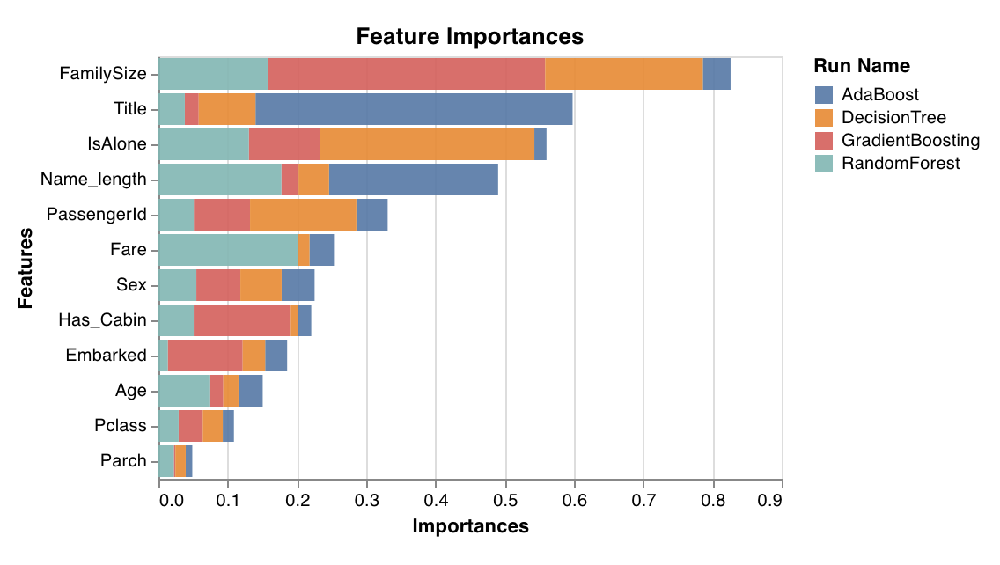

# Scikit

wandbを使用すると、数行のコードでscikit-learnモデルのパフォーマンスを視覚化して比較できます。[**例をお試しください→**](https://colab.research.google.com/drive/1j_4UQTT0Lib8ueAU5zXECxesCj_ofjw7)  


### プロットを作成します

**ステップ1：wandbをインポートし、新しい実行を初期化します。**

```python
import wandb
wandb.init(project="visualize-sklearn")

# load and preprocess dataset
# train a model
```

#### ステップ2：個々のプロットを視覚化します。

```python
# Visualize single plot
wandb.sklearn.plot_confusion_matrix(y_true, y_pred, labels)
```

####  または、すべてのプロットを一度に視覚化します。

```python
# Visualize all classifier plots
wandb.sklearn.plot_classifier(clf, X_train, X_test, y_train, y_test, y_pred, y_probas, labels,
                                                         model_name='SVC', feature_names=None)

# All regression plots
wandb.sklearn.plot_regressor(reg, X_train, X_test, y_train, y_test,  model_name='Ridge')

# All clustering plots
wandb.sklearn.plot_clusterer(kmeans, X_train, cluster_labels, labels=None, model_name='KMeans')
```

### サポートされているプロット

#### 学習曲線


 さまざまな長さのデータセットでモデルをトレーニングし、トレーニングセットとテストセット両方について、相互検証したスコアvsデータセットサイズのプロットを生成します。

`wandb.sklearn.plot_learning_curve(model, X, y)`

* model（clf or reg）：適合したリグレッサーまたは分類器を取り込みます。
* x（arr）：データセットの特徴.
* y（arr）：データセットラベル

#### ROC


ROC曲線は、真陽性率（y軸）と偽陽性率（x軸）をプロットします。理想的なスコアは、TPR = 1およびFPR = 0（つまり左上のポイント）です。通常、ROC曲線の下側の面積（AUC-ROC）を計算し、AUC-ROCが大きいほど好ましいと考えます。

`wandb.sklearn.plot_roc(y_true, y_probas, labels)`

*   y\_true（arr）：テストセットのラベル。
*  y\_probas（arr）：テストセットの予測確率。
* labels（list）：ターゲット変数（y）の名前付きラベル。

####  クラスの割合


 トレーニングセットとテストセットのターゲットクラスの分布をプロットします。不均衡なクラスを検出し、1つのクラスがモデルに不均衡な影響を与えないようにするのに役立ちます。

`wandb.sklearn.plot_class_proportions(y_train, y_test, ['dog', 'cat', 'owl'])`

* y\_train（arr）：トレーニングセットのラベル。
*  y\_test（arr）：テストセットのラベル。
*  labels（list）：ターゲット変数（y）の名前付きラベル。

#### 適合率再現率曲線


さまざまなしきい値の適合率と再現率の間のトレードオフを計算します。曲線の下の高い領域は、高い再現率と高い精度の両方を表します。高い精度は低い偽陽性率に関連し、高い再現率は低い偽陰性率に関連します。

両方のスコアが高いことは、分類子が正確な結果（高精度）を返していること、およびすべての肯定的な結果の大部分を返している（再現率が高い）ことを示しています。PR曲線は、クラスのバランスが非常に悪い場合に役立ちます。

`wandb.sklearn.plot_precision_recall(y_true, y_probas, labels)`

* y\_true（arr）：テストセットのラベル。
* y\_probas（arr）：テストセットの予測確率。
* labels（list）：ターゲット変数（y）の名前付きラベル。

####  機能の重要性



分類タスクの各機能の重要性を評価してプロットします。ツリーのように、`featureimportances`属性を持つ分類子でのみ機能します。

`wandb.sklearn.plot_feature_importances(model, ['width', 'height, 'length'])`

*  model（clf）：適合した分類器を取り入れます。
* feature\_names（list）：機能の名前。フィーチャインデックスを対応する名前に置き換えることにより、プロットを読みやすくします。

####  検量線


 分類器の予測確率がどの程度適切に調整されているか、および未調整の分類器をどのように調整するかをプロットします。ベースラインロジスティック回帰モデル、引数として渡されたモデル、およびその等張キャリブレーションとシグモイドキャリブレーションの両方によって、推定された予測確率を比較します。検量線が対角線に近いほど好ましいです。転置されたシグモイドのような曲線は過剰適合の分類器を表し、シグモイドのような曲線は過適合の分類器を表します。モデルの等張およびシグモイドキャリブレーションをトレーニングし、それらの曲線を比較することで、モデルが過適合か過小適合か、および適合している場合はどのキャリブレーション（シグモイドまたは等張）がこれを修正するのに役立つかを判断できます。

詳細については、[sklearnのドキュメント](https://scikit-learn.org/stable/auto_examples/calibration/plot_calibration_curve.html)をご覧ください。 

`wandb.sklearn.plot_calibration_curve(clf, X, y, 'RandomForestClassifier')`

*  model（clf）：適合した分類器を取り入れます。
*    x（arr）：トレーニングセットの機能。
*  y（arr）：トレーニングセットのラベル。
* model\_name（str）：モデル名。デフォルトは「分類子」

####  混同行列


 混同行列を計算して、分類精度を評価します。これは、モデル予測の品質を評価し、間違った予測のパターンを見つけるのに役立ちます。対角線は、モデルが正しく行った予測を表します。つまり、実際のラベルが予測されたラベルと等しい場合です。

`wandb.sklearn.plot_confusion_matrix(y_true, y_pred, labels)`

* y\_true（arr）：テストセットのラベル。
*  y\_pred（arr）：テストセットの予測ラベル。
*    labels（list）：ターゲット変数（y）の名前付きラベル。

####  **要約メトリック**


回帰アルゴリズムと分類アルゴリズム両方の要約メトリック（分類でのf1・正解率・適合率・再現率、そして回帰でのmse・mae・r2スコアなど）を計算します。

`wandb.sklearn.plot_summary_metrics(model, X_train, X_test, y_train, y_test)`

* model \(clf or reg\): 適合したリグレッサーまたは分類器を取り込みます。
* X \(arr\): トレーニングセットの特徴
* y \(arr\): トレーニングセットのラベル
  * X\_test \(arr\): テストセットの特徴
* y\_test \(arr\):テストセットのラベル

####  エルボープロット


 クラスター数の関数として説明される分散のパーセンテージを、トレーニング時間とともに測定してプロットします。クラスターの最適な数を選択するのに役立ちます。

`wandb.sklearn.plot_elbow_curve(model, X_train)`

*  model（clusterer）：フィットしたclustererを取り込みます。
*    x（arr）：トレーニングセットの機能。

####  シルエットプロット


1クラスター内の各ポイントが隣接するクラスター内のポイントにどれだけ近いかを測定してプロットします。クラスターの厚さは、クラスターのサイズを表します。縦線は、全ポイントの平均シルエットスコアを表します。

シルエット係数が+1に近いと、そのサンプルは隣接するクラスターから遠く離れていることを示します。値0は、サンプルが2つの隣接するクラスター間の決定境界上にあるか、それに非常に近いことを示し、負の値は、サンプルが違うクラスターに割り当てられた可能性があることを示します。

`wandb.sklearn.plot_silhouette(model, X_train, ['spam', 'not spam'])`

* model（clusterer）：フィットしたclustererを取り込みます。
* x（arr）：トレーニングセットの機能。
* cluster\_labels（list）：クラスターラベルの名前。クラスターインデックスを対応する名前に置き換えることにより、プロットを読みやすくします。

####  外れ値候補プロット


 予測目標値（y軸） vs 実際の目標値と予測目標値の差（x軸）、そして残差分布を測定してプロットします。

一般に、適切なモデルの残差はランダムに分布されていなければなりません。なぜなら、適切なモデルはランダムエラーを除いてデータセット内のほとんどの現象を構成するためです。

`wandb.sklearn.plot_outlier_candidates(model, X, y)`

* モデル（regressor）：適合した分類器を取り込みます。
* x（arr）：トレーニングセットの機能。
*   y（arr）：トレーニングセットのラベル。

####  残差プロット


予測された目標値（y軸）と実際の目標値と予測された目標値の差（x軸）、および残差の分布を測定してプロットします。

一般に、適切なモデルはランダムエラーを除いてデータセット内のほとんどの現象を説明するため、適切なモデルの残差はランダムに分布する必要があります。

`wandb.sklearn.plot_residuals(model, X, y)`

*  model（regressor）：適合した分類器を取り込みます。
*  x（arr）：トレーニングセットの機能。
* y（arr）：トレーニングセットのラベル。
* ご不明な点がございましたら、[Slackコミュニティ](http://bit.ly/wandb-forum)でお答えしたいと思います。

##  **例**

*  [colabで実行](https://colab.research.google.com/drive/1tCppyqYFCeWsVVT4XHfck6thbhp3OGwZ)：開始するためのシンプルなノートブック
*  [Wandbダッシュボード](https://wandb.ai/wandb/iris)：W＆Bで結果を表示

