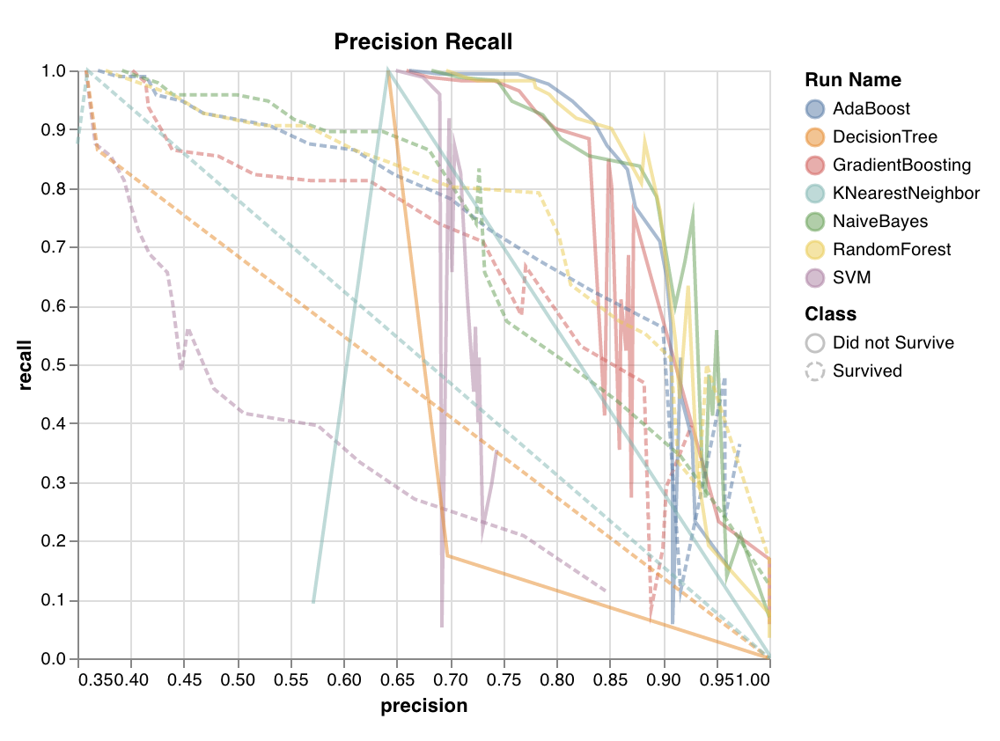
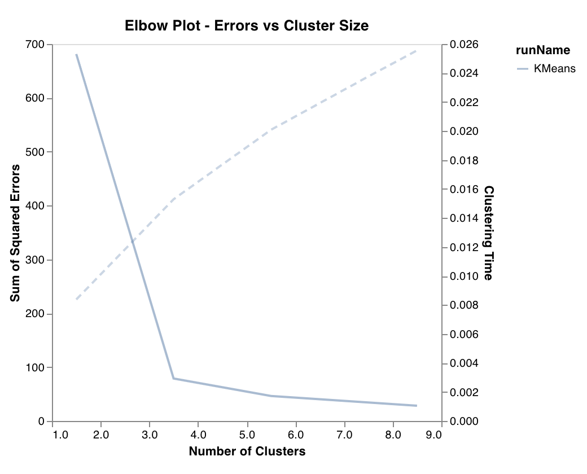

# Scikit

 ****Vous pouvez utiliser wandb pour visualiser et comparer les performances de vos modèles scikit-learn avec quelques simples lignes de code. [**Essayez cet exemple →**](https://colab.research.google.com/drive/1j_4UQTT0Lib8ueAU5zXECxesCj_ofjw7)  


###  Faire des Tracés \(plots\)

#### **Étape 1 : Importer wandb et initialiser un nouvel essai.**

```python
import wandb
wandb.init(project="visualize-sklearn")

# load and preprocess dataset
# train a model
```

####  **Étape 2 : Visualiser des tracés individuels.**

```python
# Visualize single plot
wandb.sklearn.plot_confusion_matrix(y_true, y_pred, labels)
```

#### **Ou visualiser tous les tracés d’un seul coup :**

```python
# Visualize all classifier plots
wandb.sklearn.plot_classifier(clf, X_train, X_test, y_train, y_test, y_pred, y_probas, labels,
                                                         model_name='SVC', feature_names=None)

# All regression plots
wandb.sklearn.plot_regressor(reg, X_train, X_test, y_train, y_test,  model_name='Ridge')

# All clustering plots
wandb.sklearn.plot_clusterer(kmeans, X_train, cluster_labels, labels=None, model_name='KMeans')
```

### Tracés disponibles

####  Courbe d’apprentissage


Entraînez des modèles sur des datasets de longueurs variables et générez un tracé de scores validés par recoupement contre les tailles de dataset, à la fois pour des sets d’entraînement et de tests.

`wandb.sklearn.plot_learning_curve(model, X, y)`

* model \(clf or reg\): accueille un régresseur ou un classifieur adapté.
* X \(arr\): Caractéristiques du dataset.
* y \(arr\): Labels du dataset.

#### Courbe ROC


 Les courbes ROC tracent le taux de vrais positifs \(axe y\) contre le taux de faux positifs \(axe x\). Le score idéal est TVR = 1 et TFP = 0, ce qui est le cas tout en haut à gauche. Typiquement, on calcule l’aire sous la courbe ROC \(AUC - ROC\) et plus AUC - ROC est importante, plus le résultat est bon.

`wandb.sklearn.plot_roc(y_true, y_probas, labels)`

* y\_true \(arr\): Labels du set de test.
* y\_probas \(arr\): Probabilités prédites du set de test.
* labels \(list\): Nom des labels pour la variable cible \(y\).

#### Proportions de classe


Trace la distribution des classes cibles dans les sets d’entraînement et de test. Utile pour détecter des classes déséquilibrées et s’assurer qu’une seule classe n’a pas une influence disproportionnée sur le modèle.

`wandb.sklearn.plot_class_proportions(y_train, y_test, ['dog', 'cat', 'owl'])`

* y\_train \(arr\): Labels du set d’entraînement.
* y\_test \(arr\): Labels du set de test.
* labels \(list\): Nom des labels pour la variable cible \(y\).

#### Courbe Précision-Rappel



Calcule le compromis entre la précision et le rappel pour différents paliers. Une aire importante sous la courbe représente à la fois un haut rappel et une haute précision, où une haute précision est relative à un faible taux de faux positifs, et un haut rappel est relatif à un faible taux de faux négatifs.

Le score maximal pour les deux valeurs montre que le classifieur retourne des résultats précis \(haute précision\) ainsi qu’une majorité de résultats tout positifs \(haut rappel\). La courbe PR est utile lorsque les classes sont très déséquilibrées.

`wandb.sklearn.plot_precision_recall(y_true, y_probas, labels)`

* y\_true \(arr\): Labels de set de test.
* y\_probas \(arr\): Probabilités prédites du set de test.
* labels \(list\): Nom des labels pour la variable cible \(y\)

#### Importance des caractéristiques


Évalue et trace l’importance de chaque caractéristique pour la tâche de classification. Ne fonctionne qu’avec des classifieurs qui ont l’attribut `feature_importances_` comme les arbres \(trees\).

`wandb.sklearn.plot_feature_importances(model, ['width', 'height, 'length'])`

* model \(clf\): accueille un classifieur adapté
* feature\_names \(list\): Noms pour les caractéristiques. Rend les graphiques plus simples à lire en remplaçant les index de caractéristiques par les noms correspondants.

#### Courbe de calibrage


Montre le calibrage des probabilités prédites d’un classifieur et comment calibrer un classifieur non calibré. Compare les probabilités prédites estimées à un modèle de régression logistique de base, le modèle étant passé comme un argument, et par ses calibrations isotoniques et sigmoïdes.

Plus les courbes de calibrations ressemblent à une diagonale, mieux c’est. Une courbe qui ressemble à un sigmoïde transposé représente un classifieur trop adapté, tandis qu’une courbe qui ressemble à un sigmoïde représente un classifieur pas assez adapté. En entraînant les calibrations isotoniques et sigmoïdes du modèle et en comparant leurs courbes, on peut découvrir si le modèle est trop ou trop peu adapté, et si c’est le cas, quelle calibration \(sigmoïde ou isotonique\) pourrait aider à résoudre cet état de fait.

Pour plus de détails, consultez la [documentation sklearn](https://scikit-learn.org/stable/auto_examples/calibration/plot_calibration_curve.html).

`wandb.sklearn.plot_calibration_curve(clf, X, y, 'RandomForestClassifier')`

* model \(clf\): Accueille un classifieur adapté.
* X \(arr\): Caractéristiques du set d’entraînement.
* y \(arr\): Labels du set d’entraînement.
* model\_name \(str\): Nom du modèle. Par défaut, 'Classifier

#### Matrice de confusion


Calcule la matrice de confusion pour évaluer la précision d’une classification. C’est utile pour évaluer la qualité des prédictions d’un modèle et pour trouver des schémas dans les prédictions où le modèle s’est trompé. La diagonale représente les prédictions exactes du modèle, i.e. où le label présent est égal au label prédit.

`wandb.sklearn.plot_confusion_matrix(y_true, y_pred, labels)`

* y\_true \(arr\): Labels de set de test.
* y\_pred \(arr\): Labels prédits de set de test.
* labels \(list\): Labels nommés pour la variable cible \(y\).

####  Mesures de sommaire


Calcule des mesures de sommaire \(comme f1, précision, précision et rappel pour classification et scores de mse, mae, R2 pour régression\) à la fois pour les algorithmes de régression et de classification.

`wandb.sklearn.plot_summary_metrics(model, X_train, X_test, y_train, y_test)`

* model \(clf or reg\): Accueille un régresseur ou un classifieur adapté.
* X \(arr\): Caractéristiques du set d’entraînement.
* y \(arr\): Labels du set d’entraînement.
  * X\_test \(arr\): Caractéristiques du set de test.
* y\_test \(arr\): Labels du set de test.

####  Courbe de méthode du coude



Mesure et trace le pourcentage de variance expliqué en tant que fonction du nombre de clusters, ainsi que des temps d’entraînement. Utile pour déterminer le nombre optimal de clusters.

`wandb.sklearn.plot_elbow_curve(model, X_train)`

* model \(clusterer\): Accueille un clusterer adapté.
* X \(arr\): Caractéristiques du set d’entraînement.

####  Tracé de silhouette


Mesure et trace la proximité de chaque point dans un cluster aux points dans les clusters voisins. L’épaisseur des clusters correspond à la taille des clusters. La ligne verticale représente le score moyen de silhouette pour tous les points.

 Des coefficients de silhouette proches de +1 indiquent que l’échantillon est très loin des clusters voisins. Une valeur de 0 indique que l’échantillon est sur ou très proche de la frontière de décision entre deux clusters voisins, et des valeurs négatives indiques que ces échantillons ont pu être assignés au mauvais cluster.

En général, on souhaite que les scores de cluster de silhouette soient au-dessus de la moyenne \(au-delà de la ligne rouge\) et aussi proche de 1 que possible. On préfère aussi des tailles de clusters qui reflètent les motifs sous-jacents dans les données.

`wandb.sklearn.plot_silhouette(model, X_train, ['spam', 'not spam'])`

* model \(clusterer\): Accueille un clusterer adapté.
* X \(arr\): Caractéristiques du set d’entraînement.
  * cluster\_labels \(list\): Noms pour les labels de cluster. Rend les graphiques plus simples à lire en remplaçant les index de cluster par les noms correspondants.

#### Tracé de données aberrantes


Mesure l’influence d’une donnée sur la régression de modèle via la distance de Cook. Les instances avec des influences fortement biaisées peuvent potentiellement être des données aberrantes \(outliers\). Utile pour détecter les données aberrantes.

`wandb.sklearn.plot_outlier_candidates(model, X, y)`

* model \(regressor\): Accueille un classifieur adapté.
* X \(arr\):  Caractéristiques du set d’entraînement.
* y \(arr\): Labels du set d’entraînement.

#### Graphique de résidus partiels


Mesure et trace les valeurs cibles prédites \(axe y\) contre la différence entre les valeurs cibles réelles et prédites \(axe x\), ainsi que la distribution des erreurs résiduelles.

Généralement, les résidus d’un modèle bien adapté devraient être distribués aléatoirement, parce que les bons modèles prendront en compte la plupart des phénomènes dans un dataset, à par pour des erreurs aléatoires.

`wandb.sklearn.plot_residuals(model, X, y)`

* model \(regressor\): Accueille un classifieur adapté.
* X \(arr\): Caractéristiques du set d’entraînement.
* y \(arr\): Labels du set d’entraînement.

       Si vous avez des questions, nous serons ravis d’y répondre sur notre [communauté slack](http://wandb.me/slack).

## Exemple

*  [Essayez dans colab ](https://colab.research.google.com/drive/1tCppyqYFCeWsVVT4XHfck6thbhp3OGwZ): Un notebook simple pour bien commencer
*  [Tableau de Bord WandB ](https://app.wandb.ai/wandb/iris): Visualisez des résultats sur W&B

