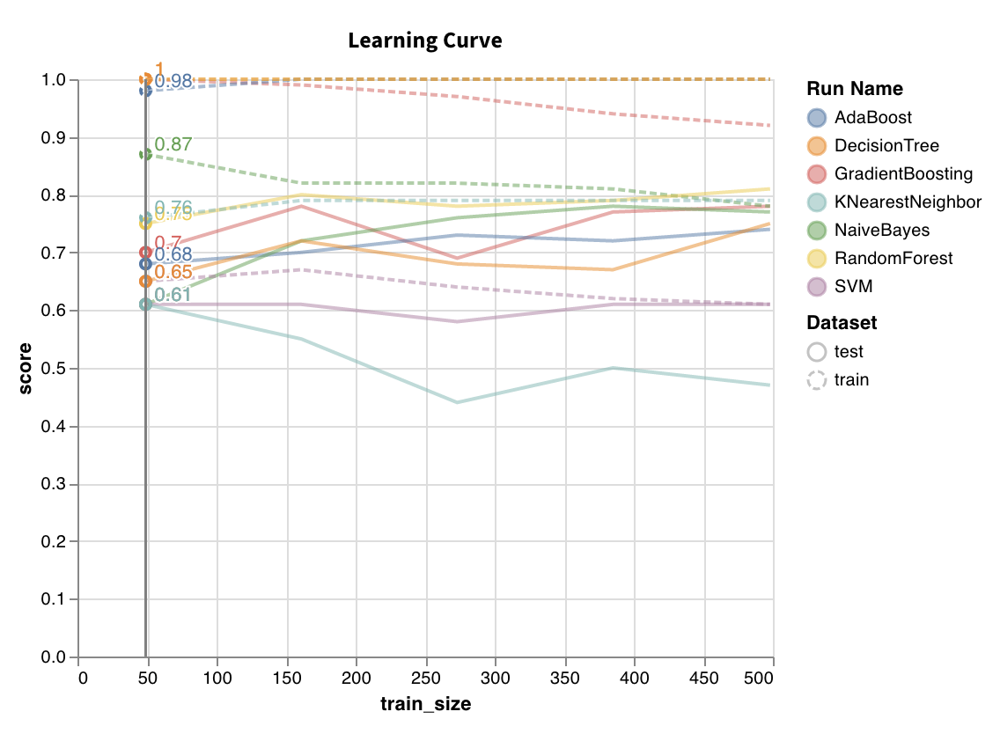
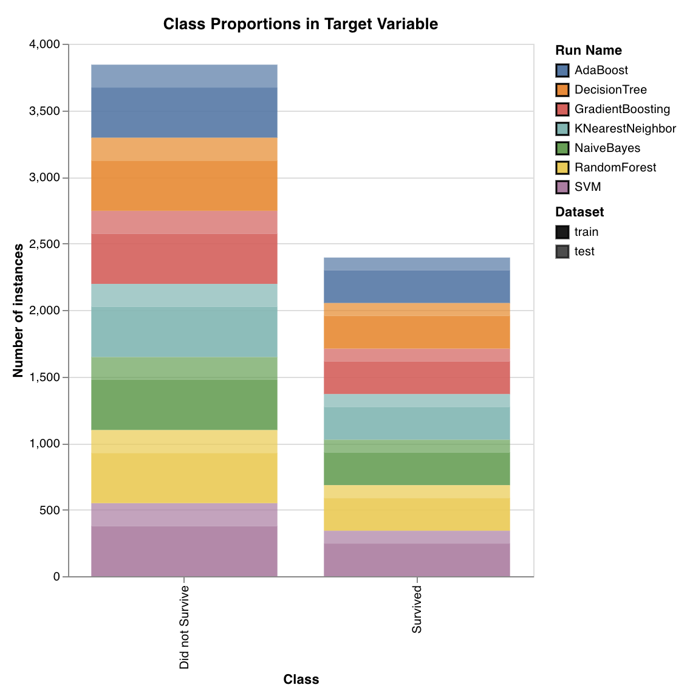
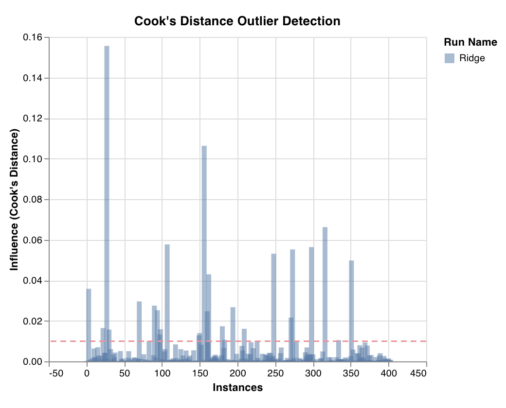

# Scikit

Puedes utilizar wandb para visualizar y comparar el desempeño de tus modelos de aprendizaje de scikit con solo algunas líneas de código.

[Prueba un ejemplo →](https://colab.research.google.com/drive/1j_4UQTT0Lib8ueAU5zXECxesCj_ofjw7)

### Haciendo Diagramas

#### Paso 1: Importa wandb e inicializa una nueva ejecución.

```python
import wandb
wandb.init(project="visualize-sklearn")

# load and preprocess dataset
# train a model
```

#### Paso 2: Visualiza los diagramas individuales.

```python
# Visualize single plot
wandb.sklearn.plot_confusion_matrix(y_true, y_pred, labels)
```

#### O visualiza a todos los diagramas a la vez:

```python
# Visualize all classifier plots
wandb.sklearn.plot_classifier(clf, X_train, X_test, y_train, y_test, y_pred, y_probas, labels,
                                                         model_name='SVC', feature_names=None)

# All regression plots
wandb.sklearn.plot_regressor(reg, X_train, X_test, y_train, y_test,  model_name='Ridge')

# All clustering plots
wandb.sklearn.plot_clusterer(kmeans, X_train, cluster_labels, labels=None, model_name='KMeans')
```

### Diagramas soportados

####  Curva de aprendizaje



Entrena el modelo sobre los conjuntos de datos de longitudes variables y genera un diagrama de puntuaciones de validación cruzada versus el tamaño del conjunto de datos, tanto para los conjuntos de entrenamiento como los de test.

`wandb.sklearn.plot_learning_curve(model, X, y)`

* model \(clf or reg\): Toma un clasificador o un regresor de entrenamiento.
* X \(arr\): Características del conjunto de datos.
* y \(arr\): Etiquetas del conjunto de datos.

#### ROC


Las curvas ROC trazan tasas positivas verdaderas \(TPR, sobre el eje y\) versus tasas positivas falsas \(FPR, sobre el eje x\). La puntuación ideal es TPR = 1 y FPR = 0, que es el punto en la esquina superior izquierda. Típicamente, calculamos el área debajo de la curva ROC \(AUC-ROC\), y cuanto mayor sea AUC-ROC, mejor.

`wandb.sklearn.plot_roc(y_true, y_probas, labels)`

* y\_true \(arr\): Etiquetas del conjunto de test.
* y\_probas \(arr\): Probabilidades predichas del conjunto de test.
* labels \(list\): Etiquetas nombradas para la variable objetivo \(y\).

#### Proporciones de clase



 Diagrama la distribución de las clases objetivo en los conjuntos de entrenamiento y de test. Es útil para detectar clases desbalanceadas, y asegurarse de que una clase no tenga una influencia desproporcionada sobre el modelo.

`wandb.sklearn.plot_class_proportions(y_train, y_test, ['dog', 'cat', 'owl'])`

* y\_train \(arr\): Etiquetas del conjunto de entrenamiento.
* y\_test \(arr\): Etiquetas del conjunto de test.
* labels \(list\): Etiquetas nombradas para la variable objetivo \(y\).

####  Curva de Precisión y Exhaustividad


Computa el compromiso entre la precisión y la exhaustividad para diferentes umbrales. Un área elevada por debajo de la curva representa alta exhaustividad y alta precisión, en donde la alta precisión se relaciona con una baja tasa de falsos positivos, y una alta exhaustividad se relaciona con una baja tasa de falsos negativos.

La alta puntuación para ambas demuestra que el clasificador está devolviendo resultados precisos \(alta precisión\), así también como una mayoría de todos los resultados positivos \(alta exhaustividad\). La curva PR es útil cuando las clases están muy desbalanceadas.

`wandb.sklearn.plot_precision_recall(y_true, y_probas, labels)`

* y\_true \(arr\): Etiquetas del conjunto de test.
* y\_probas \(arr\): Probabilidades predichas del conjunto de test.
* labels \(list\): Etiquetas nombradas para la variable objetivo \(y\)

####  Importancias de las Características


Evalúa y diagrama la importancia de cada característica para la tarea de clasificación. Sólo funciona con clasificadores que tengan un atributo `featureimportances`, como los árboles.

`wandb.sklearn.plot_feature_importances(model, ['width', 'height, 'length'])`

* model \(clf\): Toma un clasificador de entrenamiento.
* feature\_names \(list\): Nombres para las características. Hace que los diagramas sean más fáciles de leer al reemplazar los índices de las características con los nombres correspondientes.

#### Curva de calibración


Diagrama cuán bien están calibradas las probabilidades predichas de un clasificador, y cómo calibrar a un clasificador descalibrado. Compara las probabilidades predichas estimadas por un modelo de regresión logística de referencia \(el modelo pasado como argumento\), y por sus calibraciones isotónicas y sigmoides.

Cuanto más cerca estén las curvas de calibración a una diagonal, mejor. Un sigmoide transpuesto como una curva representa a un clasificador sobreajustado, mientras que un sigmoide como una curva, representa a un clasificador subajustado. Al entrenar calibraciones isotónicas y sigmoides del modelo, y comparar sus curvas, podemos darnos cuenta de si el modelo está sobreajustado o subajustado y, de esta forma, qué calibración \(sigmoide o isotónica\) podría ayudarnos a solucionarlo.

Para obtener más detalles, revisa la [documentación de sklearn](https://scikit-learn.org/stable/auto_examples/calibration/plot_calibration_curve.html).

`wandb.sklearn.plot_calibration_curve(clf, X, y, 'RandomForestClassifier')`

* model \(clf\): Toma un clasificador de entrenamiento.
* X \(arr\): Características del conjunto de entrenamiento.
* y \(arr\): Etiquetas del conjunto de entrenamiento.
* model\_name \(str\): Nombre del modelo. Por defecto es ‘Classifier’

####  Matriz de Confusión


 Computa la matriz de confusión para evaluar la precisión de una clasificación. Es útil para evaluar la calidad de las predicciones del modelo, y para encontrar patrones en las predicciones que el modelo obtiene erróneamente. La diagonal representa las predicciones que el modelo obtuvo correctamente, es decir, donde la etiqueta real es igual a la etiqueta predicha.

`wandb.sklearn.plot_confusion_matrix(y_true, y_pred, labels)`

* y\_true \(arr\): Etiquetas del conjunto de test.
* y\_pred \(arr\): Etiquetas predichas del conjunto de test.
* labels \(list\): Etiquetas nombradas para la variable objetivo \(y\).

#### Métricas de Síntesis


Calcula las métricas de síntesis \(como f1, precisión, exactitud y exhaustividad para la clasificación, y puntuación de mse, mae, r2 para la regresión\), tanto para los algoritmos de regresión como de clasificación.

`wandb.sklearn.plot_summary_metrics(model, X_train, X_test, y_train, y_test)`

* model \(clf or reg\): Toma un regresor o un clasificador de entrenamiento.
* X \(arr\): Características del conjunto de entrenamiento.
* y \(arr\): Etiquetas del conjunto de entrenamiento.
  * X\_test \(arr\): Características del conjunto de test.
* y\_test \(arr\): Etiquetas del conjunto de test.

#### Diagrama del Codo


Mide y diagrama el porcentaje de la varianza explicada como una función de números de agrupamientos, conjuntamente con los tiempos de entrenamiento. Útil para seleccionar el número óptimo de agrupamientos.

`wandb.sklearn.plot_elbow_curve(model, X_train)`

* model \(clusterer\): Toma un agrupador de entrenamiento.
* X \(arr\): Características del conjunto de entrenamiento.

#### Diagrama Silhouette


Los coeficientes Silhouette cercanos a +1 indican que la muestra está alejada de los agrupamientos vecinos. Un valor de 0 indica que la muestra está en el límite de decisión \(o muy cerca del mismo\) entre dos agrupamientos vecinos, y los valores negativos indican que aquellas muestras podrían haber sido asignadas a un agrupamiento erróneo.

En general, queremos que todos los valores de los agrupamientos Silhouette estén por encima del promedio \(después de la línea roja\), y tan cerca de 1 como sea posible. También preferimos que los tamaños de los agrupamientos reflejen patrones subyacentes en los datos.

`wandb.sklearn.plot_silhouette(model, X_train, ['spam', 'not spam'])`

* model \(clusterer\): Toma un agrupador de entrenamiento.
* X \(arr\): Características del conjunto de entrenamiento.
  * cluster\_labels \(list\): Nombres para las etiquetas de los agrupamientos. Facilita la lectura de los diagramas al reemplazar los índices de los agrupamientos con los nombres correspondientes.

#### Diagrama de Candidatos Atípicos



Mide la influencia de los puntos de datos sobre el modelo de regresión a través de la distancia de Cook. Las instancias con influencias fuertemente sesgadas podrían ser potencialmente atípicas. Es útil para la detección de atípicos.

`wandb.sklearn.plot_outlier_candidates(model, X, y)`

* model \(regressor\): Toma un clasificador de entrenamiento.
* X \(arr\): Características del conjunto de entrenamiento.
* y \(arr\): Etiquetas del conjunto de entrenamiento.

####  Diagrama de Residuales


Mide y diagrama los valores objetivos predichos \(eje y\) versus la diferencia entre los valores reales y los valores objetivo predichos \(eje x\), así también como la distribución del error residual.

Generalmente, los residuales de un modelo bien adaptado deberían ser distribuidos aleatoriamente, dado que los buenos modelos tendrán en cuenta la mayoría de los fenómenos en un conjunto de datos, excepto por los errores aleatorios.

`wandb.sklearn.plot_residuals(model, X, y)`

* model \(regressor\): Toma un clasificador de entrenamiento.
* X \(arr\): Características del conjunto de entrenamiento.
* y \(arr\): Etiquetas del conjunto de entrenamiento.

   Si tienes alguna pregunta, nos encantaría responderlas en nuestra [comunidad de Slack](http://wandb.me/slack).

## Ejemplo

*  [Ejecución](https://colab.research.google.com/drive/1tCppyqYFCeWsVVT4XHfck6thbhp3OGwZ)[ en colab](https://colab.research.google.com/drive/1tCppyqYFCeWsVVT4XHfck6thbhp3OGwZ): Una notebook simple para dar los primeros pasos
*  [Tablero de ](https://app.wandb.ai/wandb/iris)[C](https://app.wandb.ai/wandb/iris)[ontrol de Wandb](https://app.wandb.ai/wandb/iris): Mira los resultados en W&B

