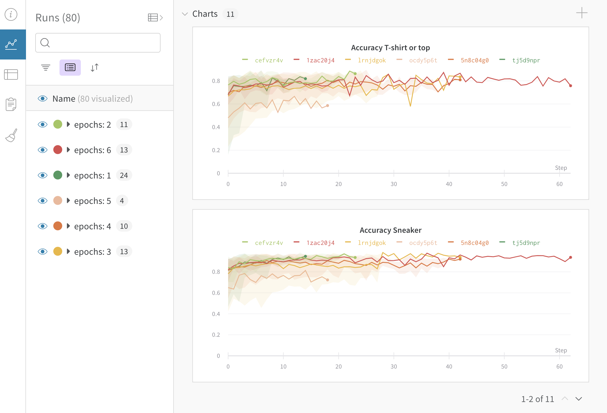

# Grouping

Regroupez des essais individuels en expériences en ajoutant un nom de groupe ****\(group\) unique à **wandb.init\(\)**.

### Cas d’utilisation

1. **Entraînement distribué** : utilisez le regroupement si vos expériences sont divisées en différentes parties avec des entraînements séparés et des scripts d’évaluation qui devraient être vus comme des parties d’un plus grand tout.
2. **Processus multiples** : regroupez de multiples petits processus ensemble dans une expérience.
3. **Validation croisée à k blocs** : Regroupez des essais avec des seeds aléatoires différentes pour visualiser une expérience plus grande. Voici [un exemple](https://github.com/wandb/examples/tree/master/examples/wandb-sweeps/sweeps-cross-validation) de validation croisée à k blocs avec des balayages et des regroupements.

### À quoi ça ressemble

Si vous programmez des regroupements dans votre script, nous regrouperons les essais par défaut dans le tableau de l’IU. Vous pouvez activer ou désactiver ceci en cliquant sur le bouton **Groupe** en haut du tableau. Voici un exemple de regroupement sur la page de projet.

*   **Barre Latérale** : Les essais \(runs\) sont regroupés par le nombre d’epochs.
* **Graphiques** : Chaque ligne représente la moyenne du groupe, et le dégradé indique la variance. Ce comportement peut être modifié dans les paramètres de graphique.

Il existe plusieurs moyens d’utiliser le regroupement :

**Programmer un groupe dans votre script**

  
Il existe plusieurs moyens d’utiliser le regroupement :

#### Programmer un groupe dans votre script

Passez un groupe optionnel et un job\_type dans wandb.init\(\). Par exemple :`wandb.init(group="experiment_1", job_type="eval")`**.** Le groupe doit être unique dans votre projet, et partagé par tous les essais de ce groupe. Vous pouvez utiliser `wandb.util.generate_id()`pour générer une ligne de 8 caractères uniques à utiliser dans tous vos processus – par exemple :`os.environ["WANDB_RUN_GROUP"] = "experiment-" + wandb.util.generate_id()`

#### Programmer une variable d’environnement de groupe

Utilisez `WANDB_RUN_GROUP` pour spécifier un groupe dans vos essais en tant que variable d’environnement. Pour plus d’informations, consultez notre documentation sur les ****[**Variables d’Environnement**](https://docs.wandb.ai/library/environment-variables)**.**

 **Activer le regroupement dans l’IU**

Vous pouvez dynamiquement regrouper n’importe quelle colonne config. Par exemple, si vous utilisez `wandb.config`pour enregistrer la taille de lot ou le taux d’apprentissage, vous pourrez ensuite regrouper selon ces hyperparamètres de manière dynamique dans l’application web.

###  Désactiver le regroupement

Cliquez sur le bouton regroupement et sur Supprimer les champs de groupe à tout moment \(clear group fields at any time\), ce qui fait retourner le tableau et les graphiques dans leur état sans groupe.

###  Paramètres de regroupement de graphique

Cliquez sur le bouton Editer en haut à droite d’un graphique et sélectionner l’onglet **Avancé** pour changer la ligne et le dégradé. Vous pouvez sélectionner la moyenne \(mean\), la valeur minimum ou maximum pour la ligne de chaque groupe. Pour le dégradé, vous pouvez désactiver le dégradé, montrer le minimum et le maximum, la déviation standard, et l’erreur standard.  

