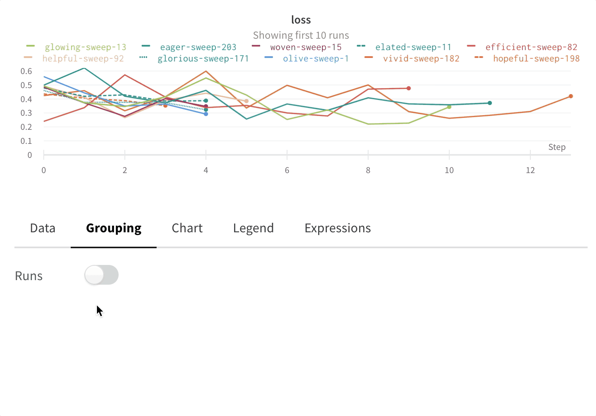

# Grouping

1つの固有**グループ**名を**wandb.init（）**に渡すことにより、個々のジョブを実験にグループ化します。

##  **ユースケース**

1. **分散型トレーニング**： 実験が個別のトレーニングスクリプトと評価スクリプトで異なる部分に分割されている場合は、グループ化を使用すると、より大きな全体として表示できます。
2. **複数のプロセス**：　複数の小さなプロセスを1つの実験にグループ化します。
3.  **K分割交差検証**： グループ化して、さまざまなランダムシードで実行し、より大きな実験を確認します。これは、スイープとグループ化を使用したk分割交差検証の[例](https://github.com/wandb/examples/tree/master/examples/wandb-sweeps/sweeps-cross-validation)です。

グループ化の方法はいくつかあります。

### **1. スクリプトにグループを設定します**

オプションのグループとjob\_typeをwandb.init（）に渡します。これによって各実験専用のグループページが与えられ、そこには個々の実行が含まれています。例：`wandb.init(group="experiment_1", job_type="eval")`

### **2. グループ環境変数を設定します**

**WANDB\_RUN\_GROUP**を使用して、実行のグループを環境変数として指定します。詳細については、[**環境変数**](https://app.gitbook.com/@weights-and-biases/s/docs/~/drafts/-MNTo635YwwyToLxk-CQ/v/japanese/library/environment-variables)のドキュメントをご確認ください。**グループ**はプロジェクト内でユニークであり、グループ内のすべての実行で共有されている必要があります。`wandb.util.generate_id()`を使用して、すべてのプロセスで使用する一意の8文字の文字列を生成できます。例：

`os.environ["WANDB_RUN_GROUP"] = "experiment-" + wandb.util.generate_id()`

### **3.  UIでグループ化を切り替えます**

任意のコンフィグ・カラムで動的にグループ化できます。たとえば、`wandb.config`を使用してバッチサイズまたは学習率をログに記録する場合、Webアプリでこれらのハイパーパラメータによって動的にグループ化できます。

## グループ化による分散トレーニング

wandb.init\(\)でグループ化を設定すると、デフォルトで、実行がUIでグループ化されます。表の上部にあるグループボタンをクリックしてオン・オフを切り替えます。これは、グループ化した[サンプルコード](http://wandb.me/grouping)から生成された[サンプルプロジェクト](https://wandb.ai/carey/group-demo?workspace=user-carey)です。 サイドバーの各「グループ」行をクリックすると、その実験専用のグループページに移動します。

上記のプロジェクトページから、左側のサイドバーのグループをクリックして、[このような](https://wandb.ai/carey/group-demo/groups/exp_5?workspace=user-carey)専用ページに移動できます。

## UIで動的にグループ化

ハイパーパラメータなど、任意のカラムで実行をグループ化できます。これがどのように見えるかの例です：

* **サイドバー**: 実行はエポック数でグループ化されます。
* **グラフ**: 各ラインはグループの平均を表し、シェーディングは分散を示します。 これは、グラフ設定で変更できます。

## グループ化をオフにします

グループ化ボタンをクリックするとグループフィールドがクリアされ、テーブルとグラフがグループ化されていない状態に戻ります。

## グラフ設定のグループ化

グラフの右上隅にある編集ボタンをクリックし、**詳細設定\(Advanced\)**タブを選択すると、線とシェーディングが変更できます。各グループの行の平均値、最小値、または最大値を選択できます。シェーディングについては、シェーディングをオフにし、最小値と最大値、標準偏差、および標準誤差を表示できます。

