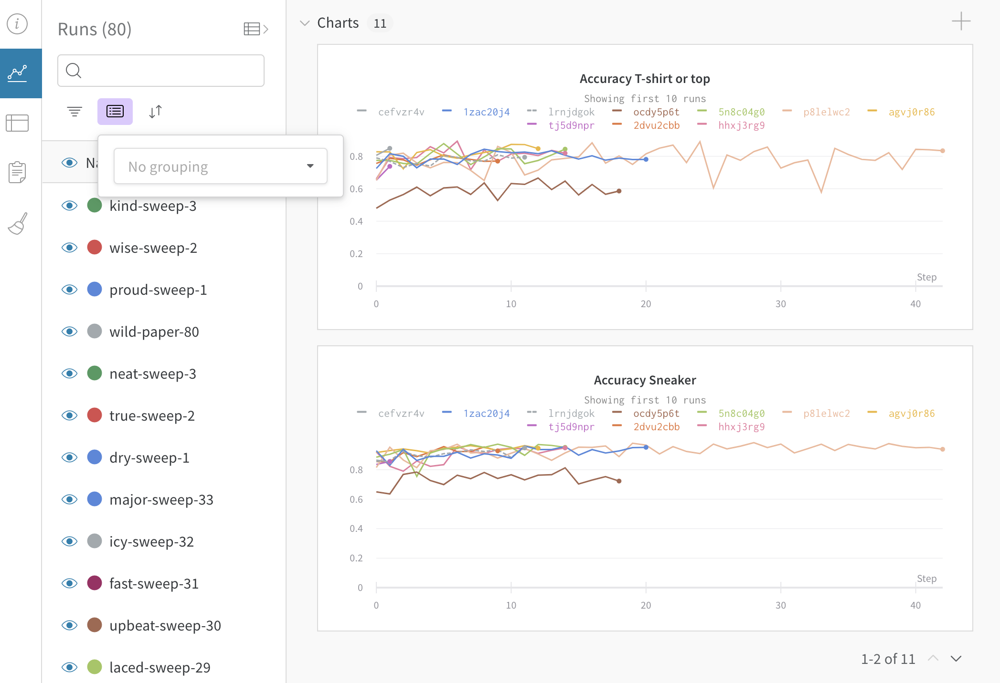

# Grouping

通过向**wandb.init\(\) 传递一个唯一的组名将单独的运行分组到实验中。**

##  **使用案例**

1. **分布式训练:** 如果你的实验拆分为有单独的训练和评估脚本的不同部分,每部分被视为更大的整体的一部分，则会使用分组。
2.  **多进程**: 将多个较小的进程分组到一个实验。
3.  **K折交叉验证（K-fold cross-validation）**: 使用不同的随机种子（seed）将运行分组到一起以查看一个更大的实验。这里有一个使用扫描和分组进行K折交叉验证的[例子](https://github.com/wandb/examples/tree/master/examples/wandb-sweeps/sweeps-cross-validation)。

有三种方式来设置分组

### **1. Set group in your script**

Pass an optional group and job\_type to wandb.init\(\). This gives you a dedicated group page for each experiment, which contains the individual runs. For example:`wandb.init(group="experiment_1", job_type="eval")`

### **2. Set a group environment variable**

Use `WANDB_RUN_GROUP` to specify a group for your runs as an environment variable. For more on this, check our docs for [**Environment Variables**]()**. Group** should be unique within your project and shared by all runs in the group.  You can use `wandb.util.generate_id()` to generate a unique 8 character string to use in all your processes— for example:`os.environ["WANDB_RUN_GROUP"] = "experiment-" + wandb.util.generate_id()`

### **3. Toggle grouping in the UI**

You can dynamically group by any config column. For example, if you use `wandb.config` to log batch size or learning rate, you can then group by those hyperparameters dynamically in the web app. 

## Distributed training with grouping

If you set grouping in `wandb.init()` , we will group runs by default in the UI. You can toggle this on and off by clicking the **Group** button at the top of the table. Here's an [example project](https://wandb.ai/carey/group-demo?workspace=user-carey) generated from [sample code](http://wandb.me/grouping) where we set grouping. You can click on each "Group" row in the sidebar to get to a dedicated group page for that experiment.

From the project page above, you can click a **Group** in the left sidebar to get to a dedicated page like [this one](https://wandb.ai/carey/group-demo/groups/exp_5?workspace=user-carey):

**它是什么样的**

如果你在你的脚本中设置了分组，我们将在UI的表格中默认对运行进行分组。你可以通过点击表格顶部的**分组**按钮来开启或关闭该功能。下面是一个项目页面上的分组示例。

* **Sidebar**: Runs are grouped by the number of epochs.
* **Graphs**: Each line represents the mean of the group, and the shading indicates the variance. This behavior can be change in the graph settings.

## **关闭分组**

点击分组按钮并清空分组字段，将使表格和图返回到未分组的状态。

## **分组图设置分组图设置**

点击图右上角的编辑按钮，选择“**高级**”选项卡来更改线条和阴影。你可以为每组中的线条选择平均值、最小值、最大值。对于阴影，你可以选择关闭阴影、显示最小和最大值、标准方差和标准误差。

