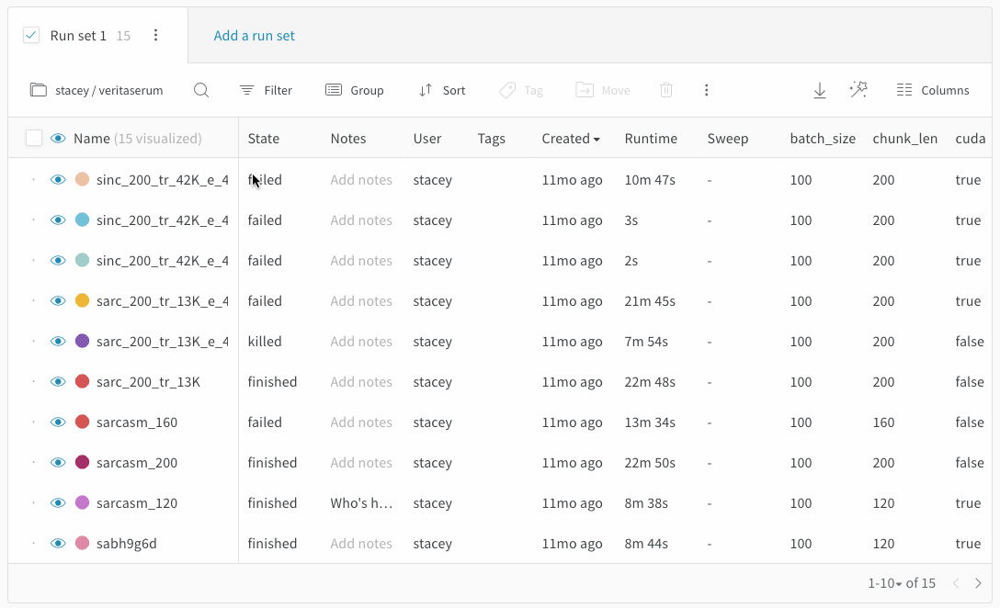

# Reports

レポートを使用すると、視覚化を整理し、調査結果を説明し、共同編集者と更新を共有できます

### **ユースケース**

1. **メモ**：簡単なメモを含むグラフを自分に追加します。
2. **コラボレーション**：調査結果を同僚と共有します。
3. **作業ログ**：試したことを追跡し、次のステップを計画します。

### [**OpenAIのケーススタディをご覧ください→**](https://bit.ly/wandb-learning-dexterity)\*\*\*\*

 [W＆Bで実](https://app.gitbook.com/@weights-and-biases/s/docs/~/drafts/-MN_4xmW6jcYndpU_n9G/v/japanese/quickstart)験を行ったら、レポートで結果を簡単に視覚化できます。次のビデオがその簡単な概要です



## **レポートの共同編集** 

レポートを保存したら、\[**共有**\]ボタンをクリックして共同作業を行うことができます。プロジェクトの可視性設定で、共同編集者がレポートにアクセスできることを確認してください。一緒に編集できるレポートを共有するには、開いているプロジェクトまたはチームプロジェクトが必要です。編集を押すと、レポートのドラフトコピーを編集することになります。

このドラフトは自動保存され、**レポートを作成するために\[保存\]**を押して、共有レポートへの変更を公開します。その間に共同編集者の1人がレポートを編集した場合、潜在的な編集の競合を解決するのに役立つ警告が表示されます。

### 

## **パネルグリッド** 

別の実行セットを比較する場合は、新しいパネルグリッドを作成します。各セクションのグラフは、そのセクションの下部にある**実行セット**によって制御されます。 

##  **静的および動的実行セット**

• **動的実行セット**：「すべてを視覚化」から開始し、実行をフィルタリングまたは選択解除して視覚化すると、実行セットが自動的に更新され、フィルターに一致する新しい実行が表示されます。

• **静的実行セット**：「視覚化無し」から開始して、実行セットに含める実行を選択すると、実行セットに含まれる実行のみが取得されます。新しい実行は追加されません。

## **レポートのエクスポート**

ダウンロードボタンをクリックして、レポートをLaTeX zipファイルとしてエクスポートします。ダウンロードしたフォルダのREADME.mdを確認して、このファイルをPDFに変換する方法を確認してください。zipファイルを[Overleaf](https://www.overleaf.com/)にアップロードしてLaTeXを簡単に編集できます。

## **クロスプロジェクトレポート**

2つの異なるプロジェクトからの実行をプロジェクト間レポートと比較します。実行セットテーブルのプロジェクトセレクタを使用して、プロジェクトを選択します。

クションの視覚化は、最初のアクティブなランセットから列をプルします。探しているメトリックが折れ線グラフに表示されない場合は、セクションでチェックした最初の実行セットでその列が使用可能であることを確認してください。この機能は時系列ラインの履歴データをサポートしますが、異なるプロジェクトから異なるサマリーメトリックを取得することはサポートしていません。そのため、別のプロジェクトにのみログインしている列に対して散布図は機能しません。2つのプロジェクトの実行を比較する必要があり、列が機能しない場合は、一方のプロジェクトの実行にタグを追加してから、それらの実行をもう一方のプロジェクトに移動します。各プロジェクトからの実行のみにフィルターをかけることはできますが、レポートでは両方の実行セットのすべての列を使用できます。

### **表示専用のレポートリンク**

プライベートプロジェクトまたはチームプロジェクトにあるレポートへの表示専用リンクを共有します。

### **レポートにグラフを送信します**

ワークスペースからレポートにグラフを送信して、進捗状況を追跡します。レポートにコピーするチャートまたはパネルのドロップダウンメニューをクリックし、**\[レポートに追加\]**をクリックしてコピー先のレポートを選択します。

## **レポートFAQ**

### Upload a C**CSVをレポートにアップロードします**

現在CSVをレポートにアップロードする場合は、wandb.Table形式でアップロードできます。PythonスクリプトにCSVをロードし、それをwandb.Tableオブジェクトとしてログに記録すると、データをレポートのテーブルとしてレンダリングできます

### **データの更新**

ページをリロードしてレポートのデータを更新し、アクティブな実行から最新の結果を取得します。\[**自動更新**\]オプションがアクティブになっている場合（ページの右上隅にあるドロップダウンメニューで使用可能）、ワークスペースは新しいデータを自動的にロードします。自動更新はレポートには適用されないため、このデータはページを再読み込みするまで更新されません。

